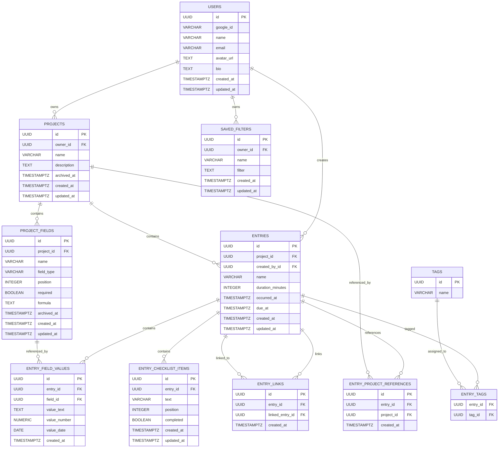

# Database & Data Layer Documentation

This document covers the PostgreSQL database design, table relationships, entity schemas, indexes, constraints, and data-layer configuration for the Digital Logbook backend.

---

## 1. Entity Relationship Diagram



## The application supports both references between projects and links between individual entries. These are separate relationships: project references connect an entry with another project, while entry links connect one log entry with another. The current entry interface exposes both kinds of relationships.

## 2. Entity Relationships

The Digital Logbook database consists of the core entities and supporting entities used by the implemented features:

* `users`
* `projects`
* `project_fields`
* `entries`
* `entry_field_values`
* `entry_checklist_items`
* `entry_project_references`
* entry-to-entry links
* entry tags
* saved filters

### Key Relationships

* **Users → Projects (1 : Many):** A user can own multiple projects.
* **Users → Entries (1 : Many):** A user can create multiple log entries.
* **Users → Saved Filters (1 : Many):** A user can create and maintain saved filters.
* **Projects → Project Fields (1 : Many):** A project can contain multiple custom fields.
* **Projects → Entries (1 : Many):** A project can contain multiple log entries.
* **Entries → Entry Field Values (1 : Many):** An entry can contain multiple custom field values.
* **Project Fields → Entry Field Values (1 : Many):** A custom field can be referenced by multiple entry field values.
* **Entries → Entry Checklist Items (1 : Many):** An entry can contain multiple checklist items.
* **Entries → Projects through Entry Project References:** An entry can reference another project.
* **Entries → Entries through Entry Links:** An entry can link to other entries.
* **Entries → Tags:** An entry can have multiple tags, and tags can be associated with multiple entries.
* **Users → Saved Filters:** Saved filters belong to the user who created them.

The entry creation workflow currently supports tags, checklist items, project references and entry links as part of the entry data.

### Foreign Key Behaviour

* Deleting a user removes their owned projects and associated dependent records according to the configured foreign-key behaviour.
* Deleting a project removes its project fields and entries through the project relationship.
* Deleting an entry removes its associated field values and entry-specific supporting records.
* Deleting a project field is restricted when it is referenced by an entry field value through `ON DELETE RESTRICT`.
* Entry project references are removed when their associated entry is deleted.
* Entry links are removed when their associated entry/link target is deleted according to the configured foreign-key behaviour.

---

## 3. Table Schemas

### `users`

Stores user profile information generated through Google OAuth authentication.

| Column       | Type           | Constraints                                 | Description                             |
| :----------- | :------------- | :------------------------------------------ | :-------------------------------------- |
| `id`         | `UUID`         | `PRIMARY KEY`, Default: `gen_random_uuid()` | Unique user identifier                  |
| `google_id`  | `VARCHAR(255)` | `NOT NULL`, `UNIQUE`                        | Unique identifier from Google OAuth     |
| `name`       | `VARCHAR(120)` | `NOT NULL`                                  | User's display name                     |
| `email`      | `VARCHAR(320)` | `NOT NULL`, `UNIQUE`                        | User's email address                    |
| `avatar_url` | `TEXT`         | `NULL`                                      | URL/data for the user's profile picture |
| `bio`        | `TEXT`         | `NULL`                                      | Optional user biography                 |
| `created_at` | `TIMESTAMPTZ`  | `NOT NULL`, Default: `NOW()`                | Date and time the user was created      |
| `updated_at` | `TIMESTAMPTZ`  | `NOT NULL`, Default: `NOW()`                | Date and time the user was last updated |

---

### `projects`

Stores high-level containers used to organise and group log entries.

| Column        | Type           | Constraints                                          | Description                                        |
| :------------ | :------------- | :--------------------------------------------------- | :------------------------------------------------- |
| `id`          | `UUID`         | `PRIMARY KEY`, Default: `gen_random_uuid()`          | Unique project identifier                          |
| `owner_id`    | `UUID`         | `NOT NULL`, `REFERENCES users(id) ON DELETE CASCADE` | User who owns the project                          |
| `name`        | `VARCHAR(120)` | `NOT NULL`                                           | Name of the project                                |
| `description` | `TEXT`         | `NULL`                                               | Description or purpose of the project              |
| `archived_at` | `TIMESTAMPTZ`  | `NULL`                                               | Timestamp indicating when the project was archived |
| `created_at`  | `TIMESTAMPTZ`  | `NOT NULL`, Default: `NOW()`                         | Date and time the project was created              |
| `updated_at`  | `TIMESTAMPTZ`  | `NOT NULL`, Default: `NOW()`                         | Date and time the project was last updated         |

---

### `project_fields`

Defines custom fields that can be added to individual projects.

The implemented field types include:

* `short_text`
* `long_text`
* `number`
* `date`
* `computed`

Computed fields store a formula used to calculate their value from other fields. The current application explicitly exposes `computed` as a field type and stores a formula for these fields.

| Column        | Type           | Constraints                                             | Description                                      |
| :------------ | :------------- | :------------------------------------------------------ | :----------------------------------------------- |
| `id`          | `UUID`         | `PRIMARY KEY`, Default: `gen_random_uuid()`             | Unique field identifier                          |
| `project_id`  | `UUID`         | `NOT NULL`, `REFERENCES projects(id) ON DELETE CASCADE` | Project that owns the custom field               |
| `name`        | `VARCHAR(100)` | `NOT NULL`                                              | Name displayed for the custom field              |
| `field_type`  | `VARCHAR(20)`  | `NOT NULL`                                              | Type of value accepted by the field              |
| `position`    | `INTEGER`      | `NOT NULL`, Default: `0`, `CHECK(position >= 0)`        | Position used when displaying fields             |
| `required`    | `BOOLEAN`      | `NOT NULL`, Default: `FALSE`                            | Indicates whether the field must be completed    |
| `formula`     | `TEXT`         | `NULL`                                                  | Formula used by computed fields                  |
| `archived_at` | `TIMESTAMPTZ`  | `NULL`                                                  | Timestamp indicating when the field was archived |
| `created_at`  | `TIMESTAMPTZ`  | `NOT NULL`, Default: `NOW()`                            | Date and time the field was created              |
| `updated_at`  | `TIMESTAMPTZ`  | `NOT NULL`, Default: `NOW()`                            | Date and time the field was last updated         |

Changes to project fields are designed to preserve existing entries rather than breaking previously recorded data.

---

### `entries`

Stores individual log events recorded within a project.

Entries support:

* activity duration
* due dates
* unfinished/incomplete work
* tags
* checklists
* project references
* links to other entries
* custom field values

| Column             | Type           | Constraints                                                             | Description                                |
| :----------------- | :------------- | :---------------------------------------------------------------------- | :----------------------------------------- |
| `id`               | `UUID`         | `PRIMARY KEY`, Default: `gen_random_uuid()`                             | Unique entry identifier                    |
| `project_id`       | `UUID`         | `NOT NULL`, `REFERENCES projects(id) ON DELETE CASCADE`                 | Project associated with the entry          |
| `created_by_id`    | `UUID`         | `NOT NULL`, `REFERENCES users(id) ON DELETE RESTRICT`                   | User who created the entry                 |
| `name`             | `VARCHAR(150)` | `NOT NULL`                                                              | Name or short description of the entry     |
| `duration_minutes` | `INTEGER`      | `NOT NULL`, Default: `0`, `CHECK(duration_minutes BETWEEN 0 AND 10080)` | Time spent on the entry                    |
| `occurred_at`      | `TIMESTAMPTZ`  | `NOT NULL`, Default: `NOW()`                                            | Date and time when the activity occurred   |
| `due_at`           | `TIMESTAMPTZ`  | `NULL`                                                                  | Optional due date/time for unfinished work |
| `created_at`       | `TIMESTAMPTZ`  | `NOT NULL`, Default: `NOW()`                                            | Date and time the entry was created        |
| `updated_at`       | `TIMESTAMPTZ`  | `NOT NULL`, Default: `NOW()`                                            | Date and time the entry was last updated   |

Due dates are part of the current entry workflow, with `dueAt` included in the entry payload when supplied.

---

### `entry_field_values`

Stores values entered into the dynamic custom fields defined in `project_fields`.

The table uses sparse storage, meaning only the value type relevant to the field is populated.

| Column         | Type            | Constraints                                                    | Description                            |
| :------------- | :-------------- | :------------------------------------------------------------- | :------------------------------------- |
| `id`           | `UUID`          | `PRIMARY KEY`, Default: `gen_random_uuid()`                    | Unique field value identifier          |
| `entry_id`     | `UUID`          | `NOT NULL`, `REFERENCES entries(id) ON DELETE CASCADE`         | Entry associated with the value        |
| `field_id`     | `UUID`          | `NOT NULL`, `REFERENCES project_fields(id) ON DELETE RESTRICT` | Custom field associated with the value |
| `value_text`   | `TEXT`          | `NULL`                                                         | Stores text-based field values         |
| `value_number` | `NUMERIC(18,4)` | `NULL`                                                         | Stores numeric field values            |
| `value_date`   | `DATE`          | `NULL`                                                         | Stores date field values               |
| `created_at`   | `TIMESTAMPTZ`   | `NOT NULL`, Default: `NOW()`                                   | Date and time the value was created    |

### Unique Constraint

The following unique constraint prevents an entry from having multiple values for the same custom field:

```sql
uq_entry_field_value (entry_id, field_id)
```

---

### `entry_checklist_items`

Stores checklist items belonging to an entry.

Checklist items have:

* an entry they belong to
* text describing the task
* a stable position
* a completed status

The current application limits a checklist to 100 items and individual checklist text to 300 characters.

| Column       | Type           | Constraints                                            | Description                             |
| :----------- | :------------- | :----------------------------------------------------- | :-------------------------------------- |
| `id`         | `UUID`         | `PRIMARY KEY`, Default: `gen_random_uuid()`            | Unique checklist item identifier        |
| `entry_id`   | `UUID`         | `NOT NULL`, `REFERENCES entries(id) ON DELETE CASCADE` | Entry that owns the checklist item      |
| `text`       | `VARCHAR(300)` | `NOT NULL`                                             | Checklist item description              |
| `position`   | `INTEGER`      | `NOT NULL`                                             | Display order                           |
| `completed`  | `BOOLEAN`      | `NOT NULL`, Default: `FALSE`                           | Whether the item has been completed     |
| `created_at` | `TIMESTAMPTZ`  | `NOT NULL`, Default: `NOW()`                           | Date and time the item was created      |
| `updated_at` | `TIMESTAMPTZ`  | `NOT NULL`, Default: `NOW()`                           | Date and time the item was last updated |

---

### `entry_project_references`

Stores references from an entry to another project.

This supports US-104, which allows entries to reference another project for additional context.

| Column       | Type          | Constraints                                             | Description                             |
| :----------- | :------------ | :------------------------------------------------------ | :-------------------------------------- |
| `id`         | `UUID`        | `PRIMARY KEY`, Default: `gen_random_uuid()`             | Unique reference identifier             |
| `entry_id`   | `UUID`        | `NOT NULL`, `REFERENCES entries(id) ON DELETE CASCADE`  | Entry containing the reference          |
| `project_id` | `UUID`        | `NOT NULL`, `REFERENCES projects(id) ON DELETE CASCADE` | Referenced project                      |
| `created_at` | `TIMESTAMPTZ` | `NOT NULL`, Default: `NOW()`                            | Date and time the reference was created |

### Unique Constraint

A unique constraint prevents the same project from being referenced more than once by an entry:

```sql
uq_entry_project_reference (entry_id, project_id)
```

The current entry interface distinguishes these project references from references/links to individual entries.

---

### Entry Links

Entry links support US-103 by connecting one log entry to another.

Unlike project references, the target of an entry link is another `entries` record.

The application maintains linked-entry IDs separately from project references and entry references.

The relationship is conceptually:

```text
entries
   |
   +---- entry_links ----> entries
```

This allows related entries to be connected without changing the underlying entry field structure.

---

### Tags

Tags allow entries to be categorised independently of their custom project fields.

The current entry interface:

* accepts tags as part of the entry payload;
* normalises tags to lowercase;
* prevents duplicate tags on the same entry;
* allows up to 10 tags per entry.

The tag relationship is many-to-many:

```text
entries
   |
   v
entry_tags
   ^
   |
 tags
```

A tag can therefore be associated with multiple entries, while an entry can have multiple tags.

---

### Saved Filters

Saved filters support US-108 by allowing a user's filter configuration to be stored and updated for later reuse.

The current API includes an update operation for saved filters:

```text
PATCH /api/projects/filters/:filterId
```

with the filter payload sent to the backend.

Saved filters therefore belong to a user and store the filter configuration required to reproduce a previously saved view.

---

## 4. Database Indexes

Indexes are created on commonly queried foreign-key columns to improve database lookup and join performance.

```sql
CREATE INDEX idx_projects_owner
ON projects (owner_id);

CREATE INDEX idx_fields_project
ON project_fields (project_id);

CREATE INDEX idx_entries_project
ON entries (project_id);

CREATE INDEX idx_values_entry
ON entry_field_values (entry_id);

CREATE INDEX idx_values_field
ON entry_field_values (field_id);
```

Supporting feature tables should also be indexed on their foreign-key columns where defined by the database schema.

### Index Purpose

| Index                 | Column                        | Purpose                                            |
| :-------------------- | :---------------------------- | :------------------------------------------------- |
| `idx_projects_owner`  | `projects.owner_id`           | Quickly find projects belonging to a user          |
| `idx_fields_project`  | `project_fields.project_id`   | Quickly find custom fields belonging to a project  |
| `idx_entries_project` | `entries.project_id`          | Quickly find entries belonging to a project        |
| `idx_values_entry`    | `entry_field_values.entry_id` | Quickly find custom values belonging to an entry   |
| `idx_values_field`    | `entry_field_values.field_id` | Quickly find values associated with a custom field |

---

## 5. Database Constraints

The database uses constraints to maintain data integrity.

### Primary Keys

The core database entities use UUID primary keys:

* `users.id`
* `projects.id`
* `project_fields.id`
* `entries.id`
* `entry_field_values.id`
* `entry_checklist_items.id`
* `entry_project_references.id`

UUIDs are generated using:

```sql
gen_random_uuid()
```

### Foreign Keys

Foreign keys maintain relationships between tables:

```text
projects.owner_id
    -> users.id

project_fields.project_id
    -> projects.id

entries.project_id
    -> projects.id

entries.created_by_id
    -> users.id

entry_field_values.entry_id
    -> entries.id

entry_field_values.field_id
    -> project_fields.id

entry_checklist_items.entry_id
    -> entries.id

entry_project_references.entry_id
    -> entries.id

entry_project_references.project_id
    -> projects.id

entry_links.entry_id
    -> entries.id

entry_links.linked_entry_id
    -> entries.id
```

### Check Constraints

The database validates specific values using `CHECK` constraints.

#### Project Field Types

The project supports:

```text
short_text
long_text
number
date
computed
```

#### Field Position

```sql
CHECK(position >= 0)
```

#### Entry Duration

```sql
CHECK(
    duration_minutes BETWEEN 0 AND 10080
)
```

#### Checklist Data

The application validates checklist size and item length before submission:

```text
Maximum checklist items: 100
Maximum item length: 300 characters
```

### Unique Constraints

Entry custom field values are unique per entry and field:

```sql
uq_entry_field_value (entry_id, field_id)
```

Entry project references are unique per entry and project:

```sql
uq_entry_project_reference (entry_id, project_id)
```

Tags are prevented from being duplicated on an individual entry.

---

## 6. Delete Behaviour

The database uses different deletion strategies depending on the relationship.

### Cascade Delete

`ON DELETE CASCADE` is used when child records should automatically be removed with their parent.

The relationship can be represented as:

```text
User
 └── Projects
      ├── Project Fields
      └── Entries
           ├── Entry Field Values
           ├── Checklist Items
           ├── Project References
           ├── Entry Links
           └── Tags
```

Deleting a project therefore removes its associated project fields and entries.

Deleting an entry removes its associated entry field values, checklist items, project references, links and tag associations.

### Restrict Delete

`ON DELETE RESTRICT` prevents deletion when another record still depends on the referenced record.

For example:

```text
project_fields
      |
      v
entry_field_values
```

A project field cannot be deleted while an entry field value still references it.

---

## 7. Setup, Reset & Seed

The database can be reset and populated using the database setup script.

Run:

```bash
node server/db/setup.js
```

The setup process performs the following steps:

1. Drops the existing `public` schema.
2. Creates a new `public` schema.
3. Executes `server/db/schema.sql`.
4. Creates the required tables and constraints.
5. Creates the database indexes.
6. Executes `server/db/seed.sql`.
7. Inserts sample development data.

### Schema Reset

The reset operation uses:

```sql
DROP SCHEMA public CASCADE;
CREATE SCHEMA public;
```

This is intended for local development and testing and should **not** be used against a production database without appropriate safeguards.

---

## 8. Seed Data

The database can be populated with sample development data using:

```text
server/db/seed.sql
```

The seed data can contain:

* Sample users
* Sample projects
* Sample project fields
* Sample entries
* Sample entry field values
* Sample checklist items
* Sample project references
* Sample tags and tag associations
* Sample saved filters

Seed data allows developers to test API endpoints and application functionality without manually creating records.

---

## 9. In-Memory Development Database

The backend supports an in-memory database mode for development and testing.

To enable it, add the following to `.env`:

```env
USE_FAKE_DB=true
```

When enabled, the repository layer bypasses the PostgreSQL `pg` driver and uses an in-memory JavaScript data structure instead.

This allows developers to run and test the backend without a PostgreSQL server running locally.

### When to Use

The fake database is useful for:

* API development
* Automated testing
* Local development
* Testing database-independent functionality
* Running the backend when PostgreSQL is unavailable

For production environments, PostgreSQL should be used instead.

---

## 10. Database Technology

| Component        | Technology                          |
| :--------------- | :---------------------------------- |
| Database         | PostgreSQL                          |
| Database Driver  | `pg`                                |
| Primary Key Type | UUID                                |
| Timestamp Type   | `TIMESTAMPTZ`                       |
| Numeric Values   | `NUMERIC(18,4)`                     |
| Development Mock | In-memory JavaScript data structure |

---

## 11. Data Layer Overview

The data layer separates database operations from the rest of the application.

The general flow is:

```text
API Request
     |
     v
Controller / Route
     |
     v
Repository / Data Layer
     |
     +--------------------+
     |                    |
     v                    v
PostgreSQL          In-Memory DB
   (pg)             (USE_FAKE_DB)
```

This structure allows the application to use either PostgreSQL or the in-memory database without changing the API layer.

---

## Person 1 Feature Data

### US-106: Add, remove or rename project fields without breaking old entries

Project fields are stored separately from entry values. Entry values reference the field identifier, allowing the application to manage changes to the project's field configuration while retaining existing entry data.

### Extra: Profile Picture Support

User profile information includes `avatar_url`, allowing a profile picture to be associated with a user.

---

## Person 2 Feature Data

### US-112: Capture Entries Offline and Sync When Connection Returns

Offline capture and synchronisation are primarily handled by the application layer. The database remains the persistent backend store used when synchronised data reaches the server.

### US-101: Tags on Entries

Tags are associated with entries independently of project custom fields. An entry can contain multiple tags, and duplicate tags are prevented for an individual entry.

---

## Person 3 Feature Data

### US-107: Statistics on Custom Fields

Statistics are calculated from project entries and their custom field values. The database does not need a separate statistics table because the statistics can be derived from the stored entry and field-value data.

The supported operations include:

* Total
* Group
* Compare
* Plot

### Extra / Client Feedback: Automatically Calculate Time Spent on an Entry

Entry duration is represented by `duration_minutes`. The application uses the entry's timing information to calculate the time spent on the entry.

---

## Person 4 Feature Data

### US-113: Export and Import the Logbook

Export and import operate on the stored logbook data. They do not require a separate core database entity.

### US-104: References Between Projects

`entry_project_references` stores references from an entry to another project.

### US-102: Checklists on Entries

`entry_checklist_items` stores the individual checklist items belonging to an entry, including their ordering and completion state.

---

## Person 5 Feature Data

### US-109: Calendar View

The calendar view uses entry date/time information, particularly `occurred_at`, to group entries by date.

### US-110: Board View Grouped by a Chosen Field

The board view uses project custom fields and entry field values to group entries dynamically according to the selected field.

### US-103: Links Between Entries

Entry links connect one entry to another entry, allowing related work to be navigated between without merging the underlying records.

---

## Person 6 Feature Data

### US-105: Values Computed Automatically from Other Fields

Computed project fields use a formula associated with the field. The current application supports `computed` as a project field type and stores the formula when such a field is created.

### US-111: Unfinished Work and Due Dates

Entries support optional due dates through `due_at`. The application also exposes outstanding and incomplete-entry operations for identifying unfinished work.

### US-108: Saved Filters

Saved filters store a user's filter configuration so that previously configured views can be reused and updated. The current API supports updating an existing saved filter.

---

## 12. Feature-to-Database Summary

| User Story | Feature                   | Main Data Used                                    |
| :--------- | :------------------------ | :------------------------------------------------ |
| US-106     | Project field changes     | `project_fields`, `entry_field_values`            |
| US-101     | Tags                      | Entries and tag associations                      |
| US-112     | Offline/sync              | Application persistence and backend data          |
| US-107     | Statistics                | `entries`, `project_fields`, `entry_field_values` |
| US-104     | Project references        | `entry_project_references`                        |
| US-102     | Checklists                | `entry_checklist_items`                           |
| US-109     | Calendar                  | `entries.occurred_at`                             |
| US-110     | Board view                | `project_fields`, `entry_field_values`            |
| US-103     | Entry links               | Entry-to-entry relationship                       |
| US-105     | Computed fields           | `project_fields.formula`, field values            |
| US-111     | Unfinished work/due dates | `entries`, `due_at`                               |
| US-108     | Saved filters             | Saved-filter data                                 |
| US-113     | Export/import             | Existing logbook entities                         |

This data model supports the implemented feature set while keeping the core logbook record centred around users, projects, project fields, entries and entry field values.
