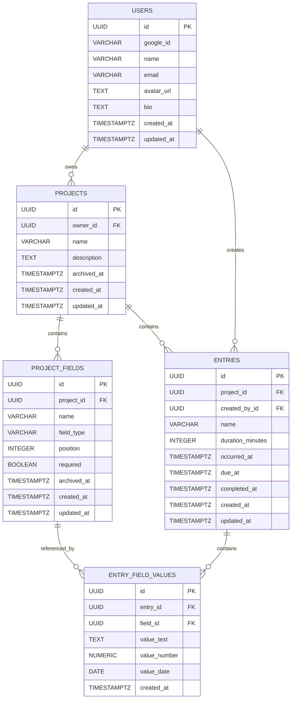

# Database & Data Layer Documentation

This document covers the PostgreSQL database design, table relationships, entity schemas, indexes, constraints, and data-layer configuration for the Digital Logbook backend.

---

## 1. Entity Relationship Diagram



---

## 2. Entity Relationships

The Digital Logbook database consists of five main entities:

* `users`
* `projects`
* `project_fields`
* `entries`
* `entry_field_values`

### Key Relationships

* **Users → Projects (1 : Many):** A user can own multiple projects.
* **Projects → Project Fields (1 : Many):** A project can contain multiple custom fields.
* **Projects → Entries (1 : Many):** A project can contain multiple log entries.
* **Entries → Entry Field Values (1 : Many):** An entry can contain multiple custom field values.
* **Project Fields → Entry Field Values (1 : Many):** A custom field can be referenced by multiple entry field values.

### Foreign Key Behaviour

* Deleting a user deletes their projects through `ON DELETE CASCADE`.
* Deleting a project deletes its project fields and entries through `ON DELETE CASCADE`.
* Deleting an entry deletes its associated field values through `ON DELETE CASCADE`.
* Deleting a project field is restricted when it is referenced by an entry field value through `ON DELETE RESTRICT`.

---

## 3. Table Schemas

### `users`

Stores user profile information generated through Google OAuth authentication.

| Column       | Type           | Constraints                                 | Description                             |
| :----------- | :------------- | :------------------------------------------ | :-------------------------------------- |
| `id`         | `UUID`         | `PRIMARY KEY`, Default: `gen_random_uuid()` | Unique user identifier                  |
| `google_id`  | `VARCHAR(255)` | `NOT NULL`, `UNIQUE`                        | Unique identifier from Google OAuth     |
| `name`       | `VARCHAR(120)` | `NOT NULL`                                  | User's display name                     |
| `email`      | `VARCHAR(320)` | `NOT NULL`, `UNIQUE`                        | User's email address                    |
| `avatar_url` | `TEXT`         | `NULL`                                      | URL of the user's profile picture       |
| `bio`        | `TEXT`         | `NULL`                                      | Optional user biography                 |
| `created_at` | `TIMESTAMPTZ`  | `NOT NULL`, Default: `NOW()`                | Date and time the user was created      |
| `updated_at` | `TIMESTAMPTZ`  | `NOT NULL`, Default: `NOW()`                | Date and time the user was last updated |

---

### `projects`

Stores high-level containers used to organise and group log entries.

| Column        | Type           | Constraints                                          | Description                                        |
| :------------ | :------------- | :--------------------------------------------------- | :------------------------------------------------- |
| `id`          | `UUID`         | `PRIMARY KEY`, Default: `gen_random_uuid()`          | Unique project identifier                          |
| `owner_id`    | `UUID`         | `NOT NULL`, `REFERENCES users(id) ON DELETE CASCADE` | User who owns the project                          |
| `name`        | `VARCHAR(120)` | `NOT NULL`                                           | Name of the project                                |
| `description` | `TEXT`         | `NULL`                                               | Description or purpose of the project              |
| `archived_at` | `TIMESTAMPTZ`  | `NULL`                                               | Timestamp indicating when the project was archived |
| `created_at`  | `TIMESTAMPTZ`  | `NOT NULL`, Default: `NOW()`                         | Date and time the project was created              |
| `updated_at`  | `TIMESTAMPTZ`  | `NOT NULL`, Default: `NOW()`                         | Date and time the project was last updated         |

---

### `project_fields`

Defines custom fields that can be added to individual projects.

Examples include fields such as `Mood`, `Mileage`, `Location`, or `Date`.

| Column        | Type           | Constraints                                                                      | Description                                      |
| :------------ | :------------- | :-------------------------------------------------------------------------------- | :----------------------------------------------- |
| `id`          | `UUID`         | `PRIMARY KEY`, Default: `gen_random_uuid()`                                       | Unique field identifier                          |
| `project_id`  | `UUID`         | `NOT NULL`, `REFERENCES projects(id) ON DELETE CASCADE`                           | Project that owns the custom field               |
| `name`        | `VARCHAR(100)` | `NOT NULL`                                                                         | Name displayed for the custom field              |
| `field_type`  | `VARCHAR(20)`  | `NOT NULL`, `CHECK(field_type IN ('short_text', 'long_text', 'number', 'date', 'computed'))`  | Data type accepted by the field                  |
| `formula`     | `TEXT`         | `NULL`                                                                             | Formula used by computed fields                  |
| `position`    | `INTEGER`      | `NOT NULL`, Default: `0`, `CHECK(position >= 0)`                                  | Position used when displaying fields in the UI   |
| `required`    | `BOOLEAN`      | `NOT NULL`, Default: `FALSE`                                                       | Indicates whether the field must be completed    |
| `archived_at` | `TIMESTAMPTZ`  | `NULL`                                                                             | Timestamp indicating when the field was archived |
| `created_at`  | `TIMESTAMPTZ`  | `NOT NULL`, Default: `NOW()`                                                       | Date and time the field was created              |
| `updated_at`  | `TIMESTAMPTZ`  | `NOT NULL`, Default: `NOW()`                                                       | Date and time the field was last updated         |

---

### `entries`

Stores individual log events recorded within a project.

| Column             | Type           | Constraints                                                             | Description                                |
| :----------------- | :------------- | :------------------------------------------------------------------------ | :----------------------------------------- |
| `id`               | `UUID`         | `PRIMARY KEY`, Default: `gen_random_uuid()`                               | Unique entry identifier                    |
| `project_id`       | `UUID`         | `NOT NULL`, `REFERENCES projects(id) ON DELETE CASCADE`                   | Project associated with the entry          |
| `created_by_id`    | `UUID`         | `NOT NULL`, `REFERENCES users(id) ON DELETE RESTRICT`                     | User who created the entry                 |
| `name`             | `VARCHAR(150)` | `NOT NULL`                                                                 | Name or short description of the entry     |
| `duration_minutes` | `INTEGER`      | `NOT NULL`, Default: `0`, `CHECK(duration_minutes BETWEEN 0 AND 10080)`   | Duration of the logged activity in minutes |
| `occurred_at`      | `TIMESTAMPTZ`  | `NOT NULL`, Default: `NOW()`                                              | Date and time when the activity occurred   |
| `due_at`           | `TIMESTAMPTZ`  | `NULL`                                                                     | Optional due date/time for outstanding work |
| `completed_at`     | `TIMESTAMPTZ`  | `NULL`                                                                     | Completion timestamp when work is completed |
| `created_at`       | `TIMESTAMPTZ`  | `NOT NULL`, Default: `NOW()`                                              | Date and time the entry was created        |
| `updated_at`       | `TIMESTAMPTZ`  | `NOT NULL`, Default: `NOW()`                                              | Date and time the entry was last updated   |

---

### `entry_field_values`

Stores values entered into the dynamic custom fields defined in `project_fields`.

The table uses sparse storage, meaning only the value type relevant to the field is populated.

| Column         | Type            | Constraints                                                    | Description                                |
| :------------- | :-------------- | :--------------------------------------------------------------- | :------------------------------------------ |
| `id`           | `UUID`          | `PRIMARY KEY`, Default: `gen_random_uuid()`                       | Unique field value identifier              |
| `entry_id`     | `UUID`          | `NOT NULL`, `REFERENCES entries(id) ON DELETE CASCADE`            | Entry associated with the value            |
| `field_id`     | `UUID`          | `NOT NULL`, `REFERENCES project_fields(id) ON DELETE RESTRICT`    | Custom field associated with the value     |
| `value_text`   | `TEXT`          | `NULL`                                                             | Stores `short_text` and `long_text` values |
| `value_number` | `NUMERIC(18,4)` | `NULL`                                                             | Stores numeric field values                |
| `value_date`   | `DATE`          | `NULL`                                                             | Stores date field values                   |
| `created_at`   | `TIMESTAMPTZ`   | `NOT NULL`, Default: `NOW()`                                       | Date and time the value was created        |

### Unique Constraint

The following unique constraint prevents an entry from having multiple values for the same custom field:

```sql
uq_entry_field_value (entry_id, field_id)
```

---

## 4. Database Indexes

Indexes are created on commonly queried foreign key columns to improve database lookup and join performance.

```sql
CREATE INDEX idx_projects_owner
ON projects (owner_id);

CREATE INDEX idx_fields_project
ON project_fields (project_id);

CREATE INDEX idx_entries_project
ON entries (project_id);

CREATE INDEX idx_values_entry
ON entry_field_values (entry_id);

CREATE INDEX idx_values_field
ON entry_field_values (field_id);
```

### Index Purpose

| Index                 | Column                        | Purpose                                            |
| :--------------------- | :----------------------------- | :--------------------------------------------------- |
| `idx_projects_owner`  | `projects.owner_id`           | Quickly find projects belonging to a user          |
| `idx_fields_project`  | `project_fields.project_id`   | Quickly find custom fields belonging to a project  |
| `idx_entries_project` | `entries.project_id`          | Quickly find entries belonging to a project        |
| `idx_values_entry`    | `entry_field_values.entry_id` | Quickly find custom values belonging to an entry   |
| `idx_values_field`    | `entry_field_values.field_id` | Quickly find values associated with a custom field |

---

## 5. Database Constraints

The database uses constraints to maintain data integrity.

### Primary Keys

Every table uses a UUID primary key:

* `users.id`
* `projects.id`
* `project_fields.id`
* `entries.id`
* `entry_field_values.id`
* `entry_checklist_items.id`
* `entry_project_references.id`
* `project_project_references.id`
* `entry_entry_references.id`
* `saved_filters.id`

UUIDs are generated using:

```sql
gen_random_uuid()
```

### Foreign Keys

Foreign keys maintain relationships between tables:

```text
projects.owner_id
    -> users.id

project_fields.project_id
    -> projects.id

entries.project_id
    -> projects.id

entries.created_by_id
    -> users.id

entry_field_values.entry_id
    -> entries.id

entry_field_values.field_id
    -> project_fields.id

entry_checklist_items.entry_id
    -> entries.id

entry_project_references.entry_id
    -> entries.id

entry_project_references.referenced_project_id
    -> projects.id

project_project_references.project_id
    -> projects.id

project_project_references.referenced_project_id
    -> projects.id

entry_entry_references.entry_id
    -> entries.id

entry_entry_references.referenced_entry_id
    -> entries.id
```

### Check Constraints

The database validates specific values using `CHECK` constraints.

#### Project Field Types

```sql
CHECK(
    field_type IN (
        'short_text',
        'long_text',
        'number',
        'date'
    )
)
```

#### Field Position

```sql
CHECK(position >= 0)
```

#### Entry Duration

```sql
CHECK(
    duration_minutes BETWEEN 0 AND 10080
)
```

---

## 6. Delete Behaviour

The database uses different deletion strategies depending on the relationship.

### Cascade Delete

`ON DELETE CASCADE` is used when child records should automatically be removed with their parent.

The relationship can be represented as:

```text
User
 └── Projects
      ├── Project Fields
      └── Entries
           └── Entry Field Values
```

Deleting a project therefore removes its associated fields and entries.

Deleting an entry removes its associated entry field values.

### Restrict Delete

`ON DELETE RESTRICT` prevents deletion when another record still depends on the referenced record.

For example:

```text
project_fields
      |
      v
entry_field_values
```

A project field cannot be deleted while an entry field value still references it.

---

## 7. Setup, Reset & Seed

The database can be reset and populated using the database setup script.

Run:

```bash
node server/db/setup.js
```

The setup process performs the following steps:

1. Drops the existing `public` schema.
2. Creates a new `public` schema.
3. Executes `server/db/schema.sql`.
4. Creates the required tables and constraints.
5. Creates the database indexes.
6. Executes `server/db/seed.sql`.
7. Inserts sample development data.

### Schema Reset

The reset operation uses:

```sql
DROP SCHEMA public CASCADE;
CREATE SCHEMA public;
```

This is intended for local development and testing and should **not** be used against a production database without appropriate safeguards.

---

## 8. Seed Data

The database can be populated with sample development data using:

```text
server/db/seed.sql
```

The seed data can contain:

* Sample users
* Sample projects
* Sample project fields
* Sample entries
* Sample entry field values

Seed data allows developers to test API endpoints and application functionality without manually creating records.

---

## 9. In-Memory Development Database

The backend supports an in-memory database mode for development and testing.

To enable it, add the following to `.env`:

```env
USE_FAKE_DB=true
```

When enabled, the repository layer bypasses the PostgreSQL `pg` driver and uses an in-memory JavaScript data structure instead.

This allows developers to run and test the backend without a PostgreSQL server running locally.

### When to Use

The fake database is useful for:

* API development
* Automated testing
* Local development
* Testing database-independent functionality
* Running the backend when PostgreSQL is unavailable

For production environments, PostgreSQL should be used instead.

---

## 10. Database Technology

| Component        | Technology                          |
| :---------------- | :------------------------------------ |
| Database         | PostgreSQL                          |
| Database Driver  | `pg`                                |
| Primary Key Type | UUID                                |
| Timestamp Type   | `TIMESTAMPTZ`                       |
| Numeric Values   | `NUMERIC(18,4)`                     |
| Development Mock | In-memory JavaScript data structure |

---

## 11. Data Layer Overview

The data layer separates database operations from the rest of the application.

The general flow is:

```text
API Request
     |
     v
Controller / Route
     |
     v
Repository / Data Layer
     |
     +--------------------+
     |                    |
     v                    v
PostgreSQL          In-Memory DB
   (pg)             (USE_FAKE_DB)
```

This structure allows the application to use either PostgreSQL or the in-memory database without changing the API layer.

## Person 4 Feature Tables

### `entry_checklist_items`

Stores checklist items belonging to an entry. Items have a position for stable display order and a completed flag for tracking progress.

### `entry_project_references`

Stores references from an entry to another project owned by the same user. The unique constraint prevents duplicate references for the same entry/project pair.

### `project_project_references`

Stores references from one project to another project. Duplicate pairs are prevented and self-references are rejected by a check constraint.

### `entry_entry_references`

Stores references from one entry to another entry. Duplicate pairs are prevented and self-references are rejected by a check constraint.

### `saved_filters`

Stores saved filter definitions for users, optionally associated with a project.
