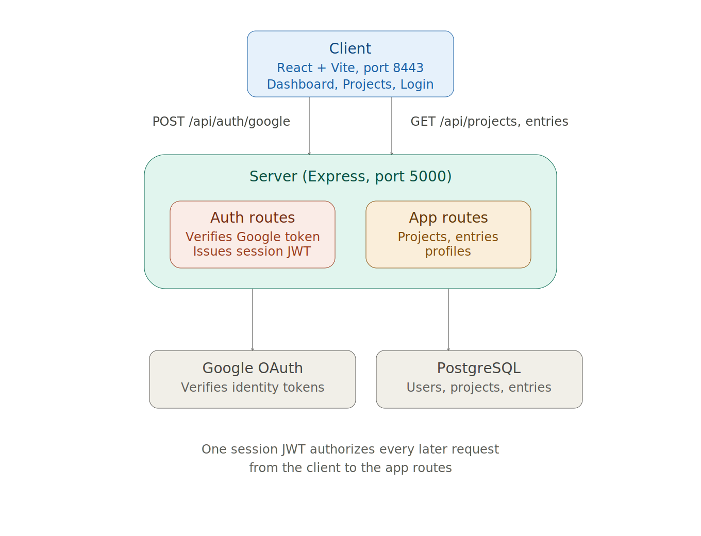

# System Architecture, Backend & API

Owner: Inga

 # Digital Logbook — System Architecture

## Overview

The Digital Logbook is a full-stack web application consisting of a React client and an Express server, backed by a PostgreSQL database. The client and server communicate over HTTP, and authentication is handled through Google OAuth combined with a session JWT issued by the server.



---

## 1. High-Level Components

| Component | Technology | Port |
| :-------- | :--------- | :--- |
| Client    | React (Vite) | 8443 |
| Server    | Express (Node.js) | 5000 |
| Database  | PostgreSQL | — |

The client sends two kinds of requests to the server:

- **Authentication requests** — go through the auth routes to verify a Google sign-in and issue a session token.
- **App requests** — go through the app routes to manage projects, project fields, entries, and user profiles.

---

## 2. Authentication Flow

1. The user signs in with Google on the client.
2. The client sends the Google ID token to the server.
3. The server verifies the token directly against Google's OAuth servers.
4. If this is the user's first sign-in, a new user record is created in the database.
5. The server issues a JWT, which the client stores and attaches to every subsequent request.
6. A dedicated route uses that JWT to identify the currently logged-in user on future requests.
7. All protected routes pass through auth middleware, which verifies the JWT before the request reaches any controller.

Once a user holds a valid JWT, that same token authorizes every later request — the server does not re-verify the Google token on every call, only once at login.

### Local Development Shortcuts

Two dev-only environment variables bypass parts of this flow for local testing:

| Variable | Purpose |
| :------- | :------ |
| `USE_FAKE_DB` | Swaps the real PostgreSQL connection for an in-memory fake, so the app can run without a real database. |
| `DEV_BYPASS_AUTH` | Skips real Google sign-in and logs the developer in as a fixed test user. |

Both are disabled (`false`) when testing against the real database and real Google authentication.

---

## 3. Backend Layered Structure

Requests to the app routes (projects, project fields, entries, profiles) flow through a consistent layered architecture:

```text
Route → Controller → Service → Repository → Database
```

| Layer | Responsibility |
| :---- | :-------------- |
| Routes | Define endpoints and map them to controllers. |
| Controllers | Handle request/response, delegate business logic to services. |
| Services | Contain business logic and orchestration. |
| Repositories | Handle database queries and data access. |
| Database | PostgreSQL, accessed through the `pg` library. |

This separation means storage changes don't require touching routing, and vice versa. Incoming data is validated with **Zod** before it reaches business logic, catching malformed requests early in the controller layer.

---

## 4. Data Model

The database consists of the core user, project, field, entry and entry-value entities, with additional feature tables for checklists, references and saved filters.

Core entities:

- `users`
- `projects`
- `project_fields`
- `entries`
- `entry_field_values`
- `entry_checklist_items`
- `entry_project_references`
- `project_project_references`
- `entry_entry_references`
- `saved_filters`

### Relationships

- **Users → Projects** (1:Many) — a user can own multiple projects.
- **Projects → Project Fields** (1:Many) — a project can define custom fields (e.g. Mood, Mileage, Location, Date).
- **Projects → Entries** (1:Many) — a project can contain multiple log entries.
- **Entries → Entry Field Values** (1:Many) — an entry can hold values for each custom field.
- **Project Fields → Entry Field Values** (1:Many) — a field definition can be referenced by many entry values.
- **Entries → Checklist Items** (1:Many) — an entry can contain ordered checklist items.
- **Entries → Project References** (1:Many) — an entry can reference other projects.
- **Projects → Project References** (1:Many) — a project can reference other projects.
- **Entries → Entry References** (1:Many) — an entry can reference other entries.
- **Projects → Saved Filters** (1:Many) — saved filter definitions can be associated with projects.

See `docs/DATABASE.md` for full table schemas, constraints, and the entity relationship diagram.

---

## 5. Request Lifecycle Example — Creating a Project

1. Client sends a request to the app routes with the project name/description and the user's JWT attached.
2. Auth middleware verifies the JWT and attaches the identified user to the request.
3. The route passes the request to the project controller.
4. The controller validates the incoming payload with Zod.
5. The service layer applies any business rules (e.g. default values, ownership assignment).
6. The repository layer inserts the new row into the `projects` table via `pg`.
7. The new project record is returned to the client and rendered in the UI.

If any step fails silently on the client side (e.g. a JS error before the request is even sent, or the JWT not being attached), the request may never reach the backend — which is why checking the browser Network tab and Console alongside backend logs is the fastest way to localize a bug in this flow.

---

## 6. Environment Configuration

Backend configuration is managed through `server/.env`:

| Variable | Description |
| :------- | :----------- |
| `PORT` | Port the Express server listens on (default `5000`). |
| `FRONTEND_URL` | URL of the client, used for CORS configuration. |
| `DATABASE_URL` | PostgreSQL connection string. |
| `USE_FAKE_DB` | Toggles the in-memory fake database for local dev. |
| `DEV_BYPASS_AUTH` | Toggles fake-user auto-login for local dev. |
| `DEV_USER_ID` / `DEV_USER_EMAIL` | Identity used when `DEV_BYPASS_AUTH` is enabled. |
| `GOOGLE_CLIENT_ID` | OAuth client ID used to verify Google sign-in tokens. |
| `JWT_SECRET` | Secret used to sign and verify session JWTs. |

> **Note:** Treat `.env` values (especially `DATABASE_URL` and `JWT_SECRET`) as secrets. They should never be committed to version control or shared in plain text outside secure channels.

---

## 7. Running Locally

```bash
# Backend
cd server
npm install
npm run dev      # starts Express on port 5000 with nodemon

# Frontend (in a separate terminal)
cd client
npm install
npm run dev       # starts Vite on port 8443
```

Both services must be running simultaneously for the app to function end-to-end.