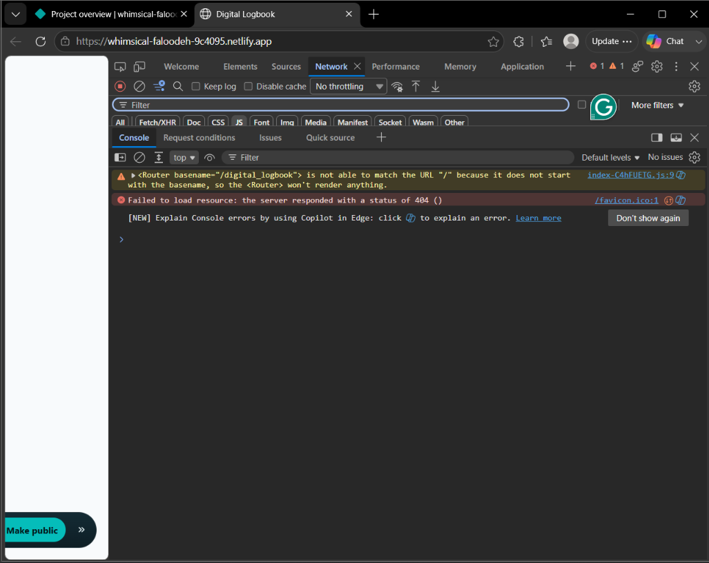
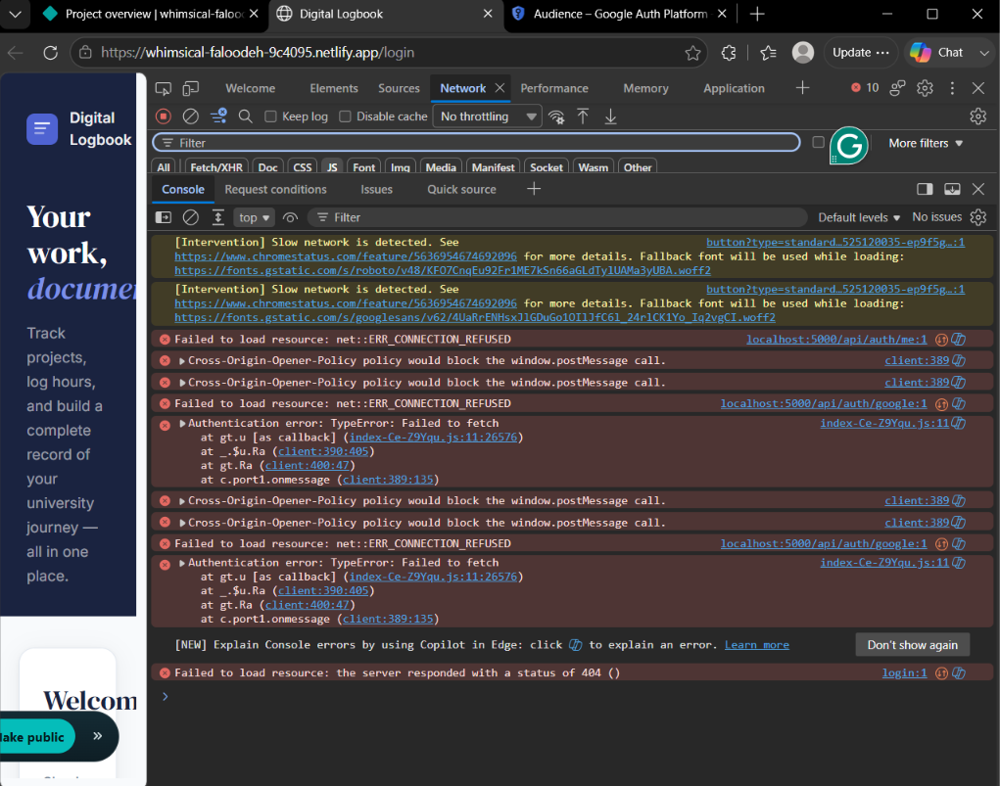
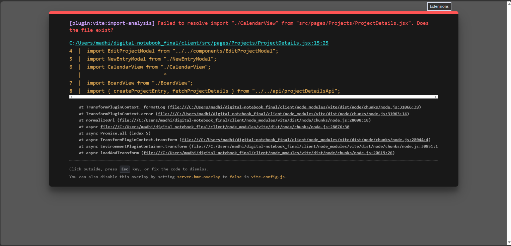
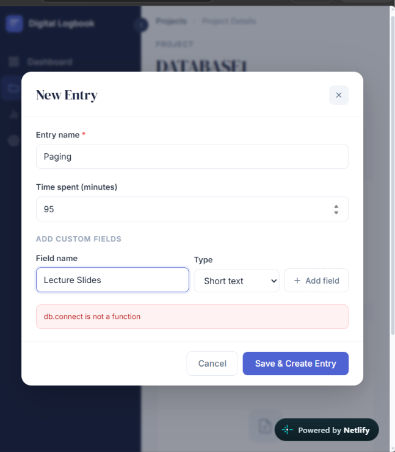
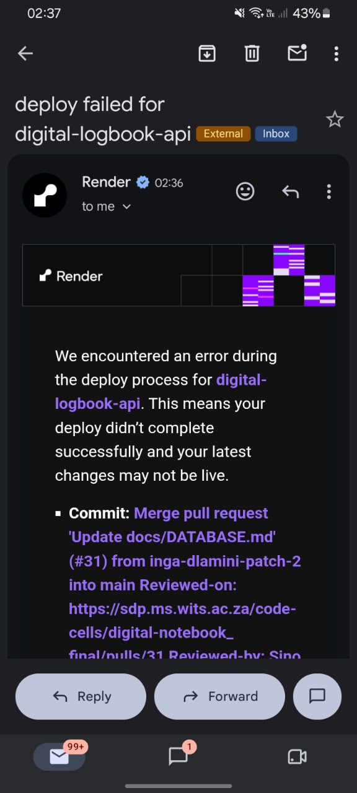

# Bug Tracking

**Project:** Digital Logbook

**Module:** COMS3011A Software Design Project

**Document Status:** Living Document

**Last Updated:** 2026-09-29

**Purpose:** To record the significant bugs and integration/deployment issues encountered during development, their impact, evidence, resolution, and current status.

---

## 1. Scope

This document records **major bugs and integration issues only**. Minor cosmetic issues, harmless browser warnings, and short-lived development mistakes are not included unless they materially affected the application's ability to build, authenticate, communicate with the backend, persist data, deploy successfully, or satisfy an important user-story acceptance criterion.

The bug tracker is maintained as evidence of:

- problems discovered during development and testing;
- the impact of those problems;
- how the team diagnosed and resolved them;
- preventive actions taken to reduce recurrence;
- the connection between implementation, testing, deployment, and stakeholder expectations.

---

## 2. Major Issue Summary

| ID      | Sprint   | Issue                                                                                     | Impact                                                                                                 | Resolution                                                                                                                                                         | Status                           |
| ------- | -------- | ----------------------------------------------------------------------------------------- | ------------------------------------------------------------------------------------------------------ | ------------------------------------------------------------------------------------------------------------------------------------------------------------------ | -------------------------------- |
| BUG-001 | Sprint 1 | Duplicate `backend/` and `server/` structures                                             | Created uncertainty about the authoritative backend and complicated authentication integration         | Authentication work was consolidated into the existing `server/` structure and the duplicate backend structure was removed                                         | Resolved                         |
| BUG-002 | Sprint 1 | Google OAuth origin/configuration mismatch                                                | Google Sign-In could not complete successfully                                                         | Correct development/production origins and Google OAuth configuration were applied                                                                                 | Resolved                         |
| BUG-003 | Sprint 1 | Authentication/database environment configuration failure                                 | Backend authentication returned server errors and users could not sign in                              | Correct database connection details and required authentication environment variables were configured                                                              | Resolved                         |
| BUG-004 | Sprint 2 | Netlify blank page caused by incorrect Vite/Router base-path configuration                | Production frontend loaded a blank/incorrect page                                                      | Vite base and React Router configuration were aligned with the Netlify root deployment and redirects were added                                                    | Resolved                         |
| BUG-005 | Sprint 2 | Production frontend attempted to call `localhost:5000`                                    | Authentication/API requests failed in the deployed site with `ERR_CONNECTION_REFUSED`                  | Production `VITE_API_URL` was configured to use the Render backend and the frontend was rebuilt/redeployed                                                         | Resolved                         |
| BUG-006 | Sprint 2 | Missing `CalendarView` module during frontend integration                                 | Vite could not compile `ProjectDetails.jsx`, blocking the frontend                                     | Missing view files/integration changes were restored and the client build was re-run successfully                                                                  | Resolved                         |
| BUG-007 | Sprint 2 | `db.connect is not a function` during entry/custom-field creation                         | Users could not save the intended entry/custom-field operation in the deployed application             | Backend/database integration was corrected and the production frontend/backend were redeployed with compatible versions                                            | Resolved                         |
| BUG-008 | Sprint 2 | Render backend deployment failed / direct Gitea deployment limitation                     | Latest backend changes could not reliably reach production                                             | Gitea remained the authoritative repository; approved `main` was mirrored to GitHub and Render deployed from the GitHub mirror                                     | Resolved                         |
| BUG-009 | Sprint 2 | Frontend deployed before matching backend Delete Entry route                              | Delete Entry returned `404 Route not found` even though the frontend action was visible                | Delete feature PR was merged into Gitea `main`, mirrored to GitHub, Render redeployed, and the Netlify frontend was rebuilt; production deletion was then verified | Resolved                         |
| BUG-010 | Sprint 3 | Board view crashed for reserved JavaScript property names such as `constructor`           | Certain field/status values could break Board rendering instead of being displayed safely              | Board grouping logic was changed to handle reserved object-property names safely                                                                                   | Resolved                         |
| BUG-011 | Sprint 3 | Entry-reference operations could return HTTP 500                                          | Users could not reliably create/use entry references                                                   | Reference handling was corrected and covered by targeted tests                                                                                                     | Resolved                         |
| BUG-012 | Sprint 3 | Existing entry references were not correctly restored in the editor                       | Editing an existing entry could omit previously saved references                                       | Edit-state/reference mapping was corrected so persisted references are loaded into the editor                                                                      | Resolved                         |
| BUG-013 | Sprint 3 | Editing entries could lose values belonging to archived/removed fields                    | Historical entry data risked being silently lost during later edits                                    | Entry-edit handling was changed to preserve archived/historical field values                                                                                       | Resolved                         |
| BUG-014 | Sprint 3 | Due-date values could shift because of timezone/date conversion                           | A saved due date could appear as a different calendar day after edit/display                           | Date handling was corrected to preserve the intended date without unintended timezone shifting                                                                     | Resolved                         |
| BUG-015 | Sprint 3 | Entry edit could partially save related changes                                           | A failed multi-part update could leave the entry in an inconsistent partially updated state            | Entry-edit operations were made safer/atomic so related changes succeed or fail together                                                                           | Resolved                         |
| BUG-016 | Sprint 3 | Recurring-entry generation used an inappropriate global cap                               | One project's generated recurring entries could affect another project's generation allowance          | Recurrence generation limits were scoped correctly and edge cases were tested                                                                                      | Resolved                         |
| BUG-017 | Sprint 3 | Frontend API tests depended on local `VITE_API_URL` assumptions                           | Tests failed when `.env` pointed to the deployed Render backend instead of localhost                   | Identified as environment-dependent test configuration; production code/build remained functional                                                                  | Known test-configuration issue   |
| BUG-018 | Sprint 3 | `ProjectDetails.jsx` was structurally corrupted during merge conflict resolution          | Vite reported invalid `await`, invalid `return`, and component-brace errors, blocking production build | Duplicate function/body and extra braces were removed; correct component/function boundaries were restored; build passed                                           | Resolved                         |
| BUG-019 | Sprint 3 | YouTube Learning Videos production integration reports “YouTube search is not configured” | Learning-video search is visible but cannot return videos in production                                | Requires the YouTube API environment variable to be configured in the deployed backend by the deployment owner                                                     | Pending deployment configuration |
| BUG-020 | Sprint 3 | AI Project Coach production integration reports temporary AI service failure              | AI progress explanation cannot currently be generated in production                                    | AI feature owner/backend deployment owner must verify the required AI/Gemini service environment configuration and availability                                    | Pending deployment configuration |

---

## 3. Detailed Issue Records

### BUG-001 — Duplicate Backend Structures

**Sprint:** Sprint 1
**Severity:** Major integration issue

**Description:**

The repository contained both a `backend/` directory and an existing `server/` directory. This created uncertainty about which backend structure was authoritative and where authentication code should be integrated.

**Impact:**

Authentication files risked being split between two competing backend structures, which would make integration and maintenance difficult for the rest of the team.

**Resolution:**

After team discussion, authentication functionality was consolidated into the existing `server/` structure and the duplicate backend structure was removed.

**Preventive Action:**

Before introducing a new top-level structure, developers should confirm the current architecture and agreed folder ownership.

**Status:** Resolved

---

### BUG-002 — Google OAuth Origin / Configuration Mismatch

**Sprint:** Sprint 1
**Severity:** Major authentication issue

**Description:**

Google Sign-In initially failed because the frontend origin was not accepted by the configured Google OAuth client.

**Observed Error:**

`The given origin is not allowed for the given client ID.`

**Impact:**

Users could not complete Google authentication.

**Resolution:**

The required development/production frontend origins were configured for the correct Google OAuth client. The frontend and backend Google authentication configuration were aligned.

**Preventive Action:**

Maintain documented development and production origins for external authentication services and verify them whenever deployment URLs change.

**Status:** Resolved

---

### BUG-003 — Authentication / Database Environment Configuration Failure

**Sprint:** Sprint 1
**Severity:** Major backend issue

**Description:**

The authentication backend failed while connecting to PostgreSQL because the local database/authentication environment configuration was incomplete or incorrect.

**Observed Error:**

`SASL: SCRAM-SERVER-FIRST-MESSAGE: client password must be a string`

**Impact:**

The authentication endpoint returned HTTP 500 and users could not sign in.

**Resolution:**

The correct PostgreSQL connection information was configured through environment variables. The required application authentication secret was also configured locally.

**Preventive Action:**

- Keep a complete `.env.example` without real secrets.
- Validate required environment variables at server startup.
- Never commit database passwords, JWT secrets, OAuth credentials, or external API keys.

**Status:** Resolved

---

### BUG-004 — Netlify Blank Page / Router Base-Path Mismatch

**Sprint:** Sprint 2
**Severity:** Major frontend deployment issue

**Description:**

The deployed Netlify frontend initially rendered incorrectly because the application was configured with a `/digital_logbook/` base/basename while the deployed application was being opened from `/`.

The browser reported:

`<Router basename="/digital_logbook"> is not able to match the URL "/" because it does not start with the basename`

**Impact:**

The production application appeared blank/unusable even though the frontend had built successfully.

**Evidence:**

**Resolution:**

- Vite's production base was corrected for the Netlify deployment.
- The unnecessary `BrowserRouter` basename was removed.
- Netlify SPA redirects were configured.
- The frontend was rebuilt and redeployed.

**Preventive Action:**

Production routing configuration must be tested using the real deployment URL before a frontend deployment is considered complete.

**Status:** Resolved

---

### BUG-005 — Production Frontend Calling Localhost Backend

**Sprint:** Sprint 2
**Severity:** Major production integration issue

**Description:**

A deployed Netlify build attempted to send authentication/API requests to:

`localhost:5000`

The production browser therefore tried to connect to the user's own machine instead of the deployed backend.

**Observed Error:**

`net::ERR_CONNECTION_REFUSED`

**Impact:**

Google authentication and API requests failed in production even though the frontend itself loaded.

**Evidence:**

**Resolution:**

- Production `VITE_API_URL` was configured to point to the Render backend.
- The client was rebuilt after changing the environment configuration.
- The latest `dist` build was redeployed to Netlify.

**Preventive Action:**

- Keep local and production API URLs separate.
- Verify the generated production build uses the deployed backend URL.
- Never commit local-only `.env` values.

**Status:** Resolved

---

### BUG-006 — Missing `CalendarView` Module During Integration

**Sprint:** Sprint 2
**Severity:** Major frontend build/integration issue

**Description:**

Vite failed to resolve the `CalendarView` import used by `ProjectDetails.jsx`.

**Observed Error:**

`Failed to resolve import "./CalendarView" from "src/pages/Projects/ProjectDetails.jsx". Does the file exist?`

**Impact:**

The frontend development/build process could not continue because `ProjectDetails.jsx` depended on a module that was not available in the working tree.

**Evidence:**

**Resolution:**

The missing/incomplete integration files were restored to the branch and the relevant Project Details views were integrated together. The client build was then run successfully.

**Preventive Action:**

- Verify all newly imported files are included in the same feature branch/PR.
- Run `npm run build --prefix client` before requesting merge.
- Avoid replacing large source directories with incomplete copies.

**Status:** Resolved

---

### BUG-007 — `db.connect is not a function`

**Sprint:** Sprint 2
**Severity:** Major backend/data integration issue

**Description:**

While creating an entry/custom field in the deployed application, the backend returned:

`db.connect is not a function`

**Impact:**

The user could reach the entry form, but the save/create operation could not complete successfully.

**Evidence:**

**Resolution:**

The team aligned the backend/database access implementation and ensured that the deployed backend and frontend were using compatible versions of the code. The production services were redeployed and the affected flow was re-tested.

**Preventive Action:**

- Keep one agreed database access abstraction.
- Avoid mixing incompatible database helper APIs.
- Run backend/service tests and end-to-end creation tests before deployment.
- Confirm Render is running the same approved `main` commit expected by the frontend.

**Status:** Resolved

---

### BUG-008 — Render Deployment Failure / Gitea Deployment Limitation

**Sprint:** Sprint 2
**Severity:** Major deployment issue

**Description:**

The backend/deployment owner encountered a Render deployment failure, and the team also identified a limitation in connecting the chosen deployment workflow directly to the official Gitea repository.

This became a stakeholder/process concern because the team had already agreed that Gitea should remain the official repository and that reviewed changes should be merged there first.

**Impact:**

- Latest backend changes were not guaranteed to be live.
- Frontend and backend versions could become unsynchronised.
- Production testing could give misleading results when Render was still running an older commit.

**Evidence:**

**Resolution:**

The team preserved the agreed development workflow:

`Feature branch → Gitea PR → Review/Approval → Gitea main`

For deployment, the approved Gitea `main` branch is mirrored to a GitHub repository:

`Gitea main → GitHub mirror main → Render`

The backend is then deployed by Render from the GitHub mirror.

**Preventive Action:**

- Keep Gitea as the authoritative repository.
- Mirror only approved/merged `main` to the deployment repository.
- Compare commit hashes before assuming production is current.
- Verify Render deployment status after every backend production update.

**Status:** Resolved for deployment workflow; deployment verification remains an ongoing responsibility.

---

### BUG-009 — Delete Entry Returned `404 Route not found` in Production

**Sprint:** Sprint 2
**Severity:** Major frontend/backend version mismatch

**Description:**

Delete Entry was visible and correctly triggered a request from the frontend, but the production backend returned:

`404 Route not found`

Investigation showed that the frontend had the new Delete Entry functionality while the Render backend was still running a version of `main` that did not yet contain the new DELETE route.

**Impact:**

The user could confirm deletion, but the entry remained unchanged. This meant the feature did not yet satisfy its acceptance criteria.

**Resolution:**

1. The Delete Entry feature branch was reviewed and merged into Gitea `main`.
2. The merged `main` was pulled locally.
3. The team verified that `deleteEntry` existed on `main`.
4. The same `main` commit was pushed to the GitHub deployment mirror.
5. Render redeployed the backend.
6. The frontend was rebuilt and redeployed to Netlify.
7. Delete Entry was tested in production and confirmed to work.

**Verification Result:**

- Delete button visible.
- Confirmation warning displayed.
- Cancelling leaves the entry unchanged.
- Confirming removes the entry.
- Refreshing the page confirms that the deletion persisted.

**Preventive Action:**

For API changes, deploy backend and frontend versions from the same approved mainline state and verify deployment commit hashes before production testing.

**Status:** Resolved and production-tested

---

### BUG-010 — Board View Crash on Reserved Property Names

**Sprint:** Sprint 3
**Severity:** Major frontend/runtime issue

**Description:**

The Board view could fail when grouping entries by a value that matched a JavaScript object property name such as:

`constructor`

The grouping implementation treated values as ordinary object keys without safely handling reserved/inherited property names.

**Impact:**

A valid project field value could cause the Board view to crash instead of displaying the grouped entries.

**Root Cause:**

Board grouping relied on normal object-property behaviour and did not safely isolate arbitrary user-provided values.

**Resolution:**

The grouping implementation was corrected so arbitrary field values, including reserved JavaScript property names, are handled safely.

The fix was reviewed and integrated through the Sprint 3 Board bug-fix work.

**Preventive Action:**

- Treat user-provided values as arbitrary data.
- Avoid assuming object keys are free of built-in property names.
- Include values such as `constructor`, `prototype`, and `toString` in edge-case tests.

**Status:** Resolved

---

### BUG-011 — Entry Reference Operations Returned HTTP 500

**Sprint:** Sprint 3
**Severity:** Major backend/integration issue

**Description:**

Entry-reference functionality could trigger an HTTP 500 response instead of completing the intended reference operation.

**Impact:**

Users could not reliably connect one entry to another, preventing the entry-reference feature from satisfying its expected behaviour.

**Resolution:**

The entry-reference contract and related request/data handling were corrected. Targeted tests were added to cover the expected behaviour.

**Preventive Action:**

- Test reference creation with valid, empty, removed, and existing reference states.
- Validate reference payloads at the API boundary.
- Keep frontend and backend reference formats documented and consistent.

**Status:** Resolved

---

### BUG-012 — Existing Entry References Missing When Editing

**Sprint:** Sprint 3
**Severity:** Major data-integrity/usability issue

**Description:**

When editing an entry that already contained entry references, the existing references were not always restored into the edit form.

**Impact:**

A user could open an existing entry for editing without seeing its previously saved references, creating a risk that references could be unintentionally removed or replaced.

**Resolution:**

The edit-state mapping was corrected so existing persisted entry references are loaded into the editor and preserved unless intentionally changed.

**Preventive Action:**

Include round-trip tests for:

`create entry with reference → reload → edit → save → reload`

**Status:** Resolved

---

### BUG-013 — Archived Field Values Lost During Entry Edit

**Sprint:** Sprint 3
**Severity:** Major data-integrity issue

**Description:**

Projects can change their entry format over time. An older entry can therefore contain values belonging to fields that are no longer active.

During entry editing, values associated with archived/removed fields risked being dropped when the updated entry was saved.

**Impact:**

Historical information could be permanently lost simply because the project structure had changed after the original entry was created.

This conflicted with the requirement to preserve historical logbook information.

**Resolution:**

Entry-edit handling was changed so values belonging to archived or historical fields remain attached to the entry even when those fields are no longer part of the active entry format.

**Preventive Action:**

Test editing against:

- current fields;
- archived fields;
- removed fields;
- projects whose field structure has changed multiple times.

**Status:** Resolved

---

### BUG-014 — Due Date Shifted Because of Timezone Conversion

**Sprint:** Sprint 3
**Severity:** Major date-handling issue

**Description:**

A due date selected as a calendar date could appear as a different day after being converted through date/time or timezone logic.

**Impact:**

Tasks could display an incorrect due date, affecting overdue/incomplete work tracking and user confidence in the recorded data.

**Resolution:**

Due-date processing was corrected so date-only values preserve the calendar day selected by the user instead of being unintentionally shifted by timezone conversion.

**Preventive Action:**

- Treat date-only fields separately from timestamp fields.
- Test due dates around midnight and across timezone offsets.
- Verify save/reload behaviour using the production timezone/environment.

**Status:** Resolved

---

### BUG-015 — Partial Entry Saves Could Leave Inconsistent Data

**Sprint:** Sprint 3
**Severity:** Major data-integrity issue

**Description:**

Editing an entry can involve multiple related changes such as the core entry, custom values, references, and associated data.

If one part of the operation failed after another part had already succeeded, the entry could be left partially updated.

**Impact:**

The stored entry could contain a mixture of old and new state instead of representing one complete user action.

**Resolution:**

The entry-edit operation was made safer so related changes are handled together and failures do not silently leave an unintended partial update.

**Preventive Action:**

- Use transactional/atomic handling for operations involving multiple related database updates.
- Test failure at each stage of a multi-step save.
- Reload the final stored state after integration tests.

**Status:** Resolved

---

### BUG-016 — Recurring Entry Generation Global Limit

**Sprint:** Sprint 3
**Severity:** Major advanced-feature logic issue

**Description:**

Recurring-entry generation included a limiting mechanism intended to prevent excessive automatic generation.

The original behaviour could apply the limit too broadly, allowing generated entries associated with one recurrence/project to interfere with the allowance available to another.

**Impact:**

A valid recurrence rule might stop producing expected entries because unrelated recurring activity had consumed the global allowance.

**Resolution:**

Recurring-entry generation and limit handling were corrected so recurrence processing is scoped appropriately. Additional edge-case tests were introduced for recurring behaviour.

**Preventive Action:**

Test recurrence logic with:

- multiple projects;
- multiple recurrence definitions;
- simultaneous eligible recurrences;
- generation limits;
- previously generated occurrences;
- disabled/deleted recurrence definitions.

**Status:** Resolved

---

### BUG-017 — Frontend API Tests Depended on Environment-Specific API URL

**Sprint:** Sprint 3
**Severity:** Test configuration/integration issue

**Description:**

Several frontend API tests expected requests to use a local backend URL. The developer environment had been configured with the deployed Render `VITE_API_URL`.

This caused tests to fail even though the application correctly used the configured production-style API endpoint.

Affected tests included API-helper tests such as entry-feature and dashboard-related tests.

**Impact:**

The test suite could report failures based on environment configuration rather than an actual application regression.

This made it harder to distinguish real implementation failures from test assumptions.

**Diagnosis:**

The failures were associated with the API base URL expected by the tests versus the URL supplied through the current `.env` environment.

**Resolution / Current Handling:**

The issue was identified as environment-dependent test configuration rather than a production build failure.

The production frontend build continued to succeed.

**Preventive Action:**

- Mock/stub the API base URL in unit tests.
- Avoid relying on the developer's real `.env`.
- Use a dedicated test environment configuration.
- Ensure tests remain deterministic regardless of whether the local environment points to localhost or Render.

**Status:** Known test-configuration issue

---

### BUG-018 — `ProjectDetails.jsx` Corrupted During Sprint 3 Merge Conflict Resolution

**Sprint:** Sprint 3
**Severity:** Major integration/build issue

**Description:**

While merging the latest `main` changes into the UI-polish branch, `ProjectDetails.jsx` contained overlapping changes from multiple features, including:

- archiving;
- reminders;
- AI Project Coach;
- Learning Videos;
- automation;
- recurring entries;
- saved filters;
- search;
- entry editing;
- UI polish.

Manual conflict resolution accidentally introduced duplicate function declarations/bodies and extra braces.

**Observed Build Errors:**

Examples included:

`await is only allowed within async functions and at the top levels of modules`

and:

`A 'return' statement can only be used within a function body.`

VS Code also displayed the closing brace of the `ProjectDetails` component as invalid because the component had been prematurely closed earlier in the file.

**Impact:**

The frontend could not build, which blocked integration and deployment of the UI-polish branch.

**Root Cause:**

A duplicated `handleDeleteEntry` declaration/body and extra braces created incorrect component/function boundaries during manual merge conflict resolution.

**Resolution:**

The file was inspected and repaired while preserving both the latest `main` functionality and the UI-polish work.

The repair:

- removed the duplicate `handleDeleteEntry`;
- removed the duplicated delete body;
- removed extra braces;
- restored correct function boundaries;
- ensured `ProjectDetails` closes before `ReferenceSelectionModal`;
- preserved archiving behaviour;
- preserved saved filters/search;
- preserved Learning Videos;
- preserved AI Project Coach;
- preserved automation and recurring-entry features;
- removed all remaining merge markers.

**Verification:**

Production frontend build succeeded:

`vite v8.2.1`

`✓ 1850 modules transformed`

`✓ built`

A bundle-size warning remained, but this was non-blocking.

**Preventive Action:**

- Avoid manually replacing large JSX sections when resolving conflicts.
- Resolve one conflict block at a time.
- Run `git diff --check`.
- Search for remaining `<<<<<<<`, `=======`, and `>>>>>>>` markers.
- Run the production build before concluding the merge.
- Use targeted tests after resolving large multi-feature conflicts.

**Status:** Resolved

---

### BUG-019 — YouTube Search Not Configured in Production

**Sprint:** Sprint 3
**Severity:** Production integration/configuration issue

**Description:**

The Learning Videos interface loads correctly in the deployed frontend, but attempting to use the feature produces:

`Unable to load videos`

`YouTube search is not configured.`

**Impact:**

Users can see the Learning Videos feature but cannot retrieve YouTube learning resources in production.

**Diagnosis:**

The frontend component is deployed and communicating with the application. The error indicates that the deployed backend does not currently have the required YouTube API configuration available.

The API key must remain server-side and should not be embedded into the public Vite frontend bundle.

**Required Resolution:**

The YouTube feature owner should coordinate with the backend deployment owner to:

1. determine the environment-variable name expected by the YouTube service;
2. configure the provided YouTube API key in the deployed backend environment;
3. redeploy/restart the backend if required;
4. test Learning Videos again from the production Netlify application.

**Preventive Action:**

- Document external API environment-variable requirements in `.env.example`.
- Include external-service configuration in the deployment checklist.
- Do not expose secret API keys in `VITE_` frontend variables unless the service is explicitly designed for public browser credentials.

**Status:** Pending backend deployment configuration

---

### BUG-020 — AI Project Coach Service Unavailable in Production

**Sprint:** Sprint 3
**Severity:** Production external-service integration issue

**Description:**

The AI Project Coach interface loads successfully, but requesting a project explanation currently displays:

`Unable to generate insight`

`The AI service is temporarily unavailable. Please try again shortly.`

**Impact:**

Users cannot currently generate AI-powered project progress explanations on the deployed application.

**Diagnosis:**

The frontend feature itself is present and rendering correctly. The failure occurs when attempting to use the external AI service.

The AI feature owner and backend deployment owner need to verify the production AI-service configuration.

Possible deployment-level causes include:

- missing AI/Gemini API environment variable;
- invalid or restricted API credentials;
- external service availability;
- quota or configuration limitations.

The exact root cause remains to be confirmed by the feature/deployment owner.

**Required Resolution:**

The AI feature owner should coordinate with the backend deployment owner to verify:

- the expected environment-variable name;
- that the correct API credential exists in the backend deployment;
- that the deployed backend can reach the AI service;
- that production requests succeed after configuration.

**Preventive Action:**

External API integrations should include:

- documented environment variables;
- production deployment instructions;
- graceful error messages;
- configuration/startup checks where appropriate;
- a deployment verification step.

**Status:** Pending investigation / backend deployment configuration

---

## 4. Evidence Index

The following screenshots and records are retained as supporting evidence for major bugs and integration issues.

| Evidence File / Record                    | Related Bug               | What It Demonstrates                                       |
| ----------------------------------------- | ------------------------- | ---------------------------------------------------------- |
| `images/router-basename-warning.png`      | BUG-004                   | Router basename mismatch on Netlify                        |
| `images/frontend-localhost-api-error.png` | BUG-005                   | Production frontend attempting to call `localhost:5000`    |
| `images/calendar-view-import-error.png`   | BUG-006                   | Vite failing to resolve `CalendarView`                     |
| `images/db-connect-error.png`             | BUG-007                   | `db.connect is not a function` during entry creation       |
| `images/render-deploy-failed.jpeg`        | BUG-008                   | Render deployment failure notification                     |
| Sprint 3 Board tests / PR                 | BUG-010                   | Reserved-property Board grouping failure and fix           |
| Sprint 3 entry-reference tests / PR       | BUG-011, BUG-012          | Entry-reference API/editor behaviour                       |
| Sprint 3 entry-edit safety tests / PR     | BUG-013, BUG-014, BUG-015 | Archived values, date handling, and safe updates           |
| Sprint 3 recurring-entry tests / PR       | BUG-016                   | Recurrence generation limit behaviour                      |
| Frontend test output                      | BUG-017                   | Environment-dependent API URL test failures                |
| Vite build output during UI integration   | BUG-018                   | Invalid `await`/`return` syntax caused by merge corruption |
| Production Learning Videos screenshot     | BUG-019                   | YouTube search reports missing configuration               |
| Production AI Project Coach screenshot    | BUG-020                   | AI service reports temporary unavailability                |

The browser favicon `404` shown in one earlier screenshot is not tracked as a major bug because it did not block core application functionality.

---

## 5. Sprint 3 Verification After Fixes

During Sprint 3, the following integration/build behaviour was verified after the relevant fixes:

- Board grouping no longer depends on unsafe assumptions about object-property names.
- Entry references are included in the intended create/edit workflow.
- Existing entry references are restored during editing.
- Historical values belonging to archived fields are preserved.
- Due-date handling avoids unintended timezone date shifts.
- Entry-edit safety was improved to prevent inconsistent partial updates.
- Recurring-entry edge cases received targeted test coverage.
- Automation functionality received targeted edge-case testing.
- Coverage was added for project and transfer-related backend code.
- The UI-polish branch was updated with the latest `main` changes.
- The `ProjectDetails.jsx` merge corruption was repaired.
- All merge conflicts were marked resolved in Git.
- The production frontend build completed successfully.
- The integrated Project Details page includes current Sprint 3 functionality such as:
  - automation;
  - recurring entries;
  - AI Project Coach;
  - Learning Videos;
  - archiving;
  - search and saved filters;
  - list/calendar/board views;
  - entry references;
  - entry editing and deletion.

**Known production integration items remaining:**

- YouTube Learning Videos requires backend API-key/environment configuration.
- AI Project Coach requires verification of its deployed external-service configuration.
- These external-service configuration tasks belong to the relevant feature/deployment owners rather than the frontend UI-polish implementation.

**Overall Sprint 3 integration status:** Core application build and integrated UI are operational; identified external API deployment configuration remains pending.

---

## 6. Lessons and Preventive Actions

The major Sprint 1, Sprint 2, and Sprint 3 issues produced the following team lessons:

1. **Keep one authoritative architecture.**
   Avoid duplicate backend structures or competing database abstractions.

2. **Keep Gitea as the official review source.**
   Deployment tooling should not bypass the agreed branch/PR/review process.

3. **Synchronise production frontend and backend versions.**
   A new UI feature may fail if the corresponding backend route has not been deployed.

4. **Use environment-specific configuration.**
   Production builds must never depend on `localhost` APIs.

5. **Build before merge/deployment.**
   Missing imports and merge-corrupted JSX should be caught before deployment.

6. **Test full flows, not only individual components.**
   Important operations should be verified from UI → API → backend → database → refreshed UI state.

7. **Treat deployment as part of testing.**
   A locally working feature is not considered production-ready until the deployed services are running the intended commits and configuration.

8. **Record evidence.**
   Screenshots, console errors, tests, PRs, deployment checks, and build outputs should be retained for significant issues.

9. **Preserve historical data when schemas evolve.**
   Editing old entries must not remove information just because the current project format has changed.

10. **Treat user-controlled values as arbitrary data.**
    Values such as `constructor` must not break grouping or object-based logic.

11. **Use atomic operations for related updates.**
    Multi-step entry changes should not leave partial data when one stage fails.

12. **Treat dates and timestamps differently.**
    Date-only values such as due dates should not be unintentionally shifted through timezone conversion.

13. **Keep tests independent from developer-specific `.env` configuration.**
    Unit tests should mock configuration rather than depend on whichever API URL is active locally.

14. **Resolve large merge conflicts cautiously.**
    Multi-feature files such as `ProjectDetails.jsx` should be repaired incrementally and validated using the production build.

15. **External APIs require deployment configuration as well as source code.**
    YouTube, AI/Gemini, authentication, and similar integrations must document the environment variables required by the deployed backend.

16. **Secrets belong on the server.**
    External API keys and authentication secrets must not be exposed through public frontend bundles.

---

## 7. Bug Tracking Process Going Forward

New significant bugs should be recorded with:

- unique bug ID;
- sprint/date where known;
- severity;
- description;
- user/system impact;
- evidence where available;
- diagnosis/root cause;
- resolution;
- preventive action;
- current status;
- relevant PR/commit/issue reference where available.

For external-service bugs, also record:

- whether the problem occurs locally, in production, or both;
- whether the failure is frontend, backend, deployment, or third-party-service related;
- the responsible feature/deployment owner;
- whether an environment variable or secret is required;
- whether production was re-tested after configuration.

Resolved bugs should remain in this document to preserve development history and traceability.

---

## 8. Revision History

| Version | Date       | Author          | Changes                                                                                                                                                                                                                                                                        |
| ------- | ---------- | --------------- | ------------------------------------------------------------------------------------------------------------------------------------------------------------------------------------------------------------------------------------------------------------------------------ |
| 0.1     | Sprint 1   | Team            | Initial major authentication/integration bugs recorded.                                                                                                                                                                                                                        |
| 0.2     | 15/09/2026 | Simphiwe / Team | Document refocused on major issues; Sprint 2 Netlify, API configuration, module integration, database, Render/Gitea deployment, and Delete Entry deployment issues added with evidence and resolutions.                                                                        |
| 0.3     | 29/09/2026 | Simphiwe / Team | Added Sprint 3 Board reserved-key crash, entry-reference issues, entry-edit data preservation/date/atomicity fixes, recurring-entry limit issue, environment-dependent API tests, ProjectDetails merge corruption, and outstanding YouTube/AI production configuration issues. |
