# Project Methodology, Sprint Planning & Work Tracker

Owner: Tumi

## 1. Agile/Scrum Methodology

Our project will follow an **Agile/Scrum methodology** because the project is being developed incrementally and requires regular feedback and adaptation. Instead of attempting to complete the entire system at once, the project will be divided into smaller features and tasks that can be implemented, tested, reviewed, and improved over multiple sprints.

Scrum is suitable for our group because it allows team members to work on different features concurrently while maintaining regular communication about progress and problems. It also allows requirements and priorities to be adjusted as the project develops.

Our Scrum process will consist of:

* **Product Backlog** – a prioritised list of features, requirements, bugs, and improvements.
* **Sprint Backlog** – the subset of backlog items selected for the current sprint.
* **Sprints** – short development cycles during which the selected tasks are implemented and tested.
* **Regular check-ins** – short meetings where members discuss progress, upcoming work, and blockers.
* **Sprint Review** – demonstration of completed functionality and discussion of feedback.
* **Sprint Retrospective** – reflection on what went well, what did not, and what can be improved in the next sprint.

This approach allows us to continuously deliver working functionality rather than waiting until the end of the project.

## 2. How Scrum Will Be Applied

At the beginning of each sprint, the team will review the Product Backlog and select the highest-priority items that can realistically be completed during the sprint.

Each selected item will be broken down into smaller tasks and assigned to team members. Team members will update the work tracker as they progress.

The general workflow will be:

**Backlog → To Do → In Progress → Review/Testing → Done**

Tasks will only be moved to **Done** once they satisfy the team's Definition of Done.

If requirements change during development, the team will discuss the change and update the backlog rather than making uncontrolled changes to the current sprint.

## 3. Sprint Backlog Process

The Sprint Backlog will contain the tasks selected for the current sprint.

During sprint planning, the team will:

1. Review the Product Backlog.
2. Prioritise the most important requirements.
3. Estimate the effort required for each task.
4. Select tasks that can realistically be completed within the sprint.
5. Break larger requirements into smaller development tasks.
6. Assign tasks to team members.
7. Confirm that the sprint has a realistic workload.

Tasks that are not completed during a sprint will be reviewed during the next planning session. They may be carried forward, reprioritised, or broken into smaller tasks.

## 4. Work Tracker

The work tracker will be used to provide a shared view of the project's progress. The team's Taiga board can be found here: [Taiga – Madhingadi Digital Logbook Backlog](https://tree.taiga.io/project/madhingadi-digital-logbook/backlog).

Each task should contain enough information for another team member to understand what needs to be done. Where appropriate, tasks should include:

* Task description
* User story or requirement
* Assigned member
* Priority
* Status
* Sprint
* Relevant issue or pull request
* Testing requirements

Tasks will move through the tracker as development progresses:

| Status             | Meaning                                                                  |
| ------------------ | ------------------------------------------------------------------------ |
| **To Do**          | Task has been selected but development has not started.                  |
| **In Progress**    | A team member is actively working on the task.                           |
| **Review/Testing** | Implementation is complete and is being reviewed or tested.              |
| **Done**           | The task satisfies the Definition of Done.                               |
| **Blocked**        | Progress cannot continue because of an unresolved dependency or problem. |

The tracker will help the team identify unfinished work and prevent tasks from being forgotten.

## 5. Blocker Handling

A blocker is an issue that prevents a team member from continuing with their assigned work.

Examples include:

* Waiting for another feature or API to be completed.
* Technical problems that cannot be resolved independently.
* Missing requirements or unclear acceptance criteria.
* Problems with the development environment.
* Integration or merge conflicts.

When a blocker occurs, the member should **raise it as soon as possible** rather than waiting until the end of the sprint.

The team will then determine whether another member can assist, whether the task needs to be temporarily changed, or whether the task should be reprioritised.

Blocked tasks will be clearly marked in the work tracker so that the rest of the team is aware of the issue.

## 6. Definition of Done

A task will be considered **Done** when:

* The required functionality has been implemented.
* The implementation satisfies the relevant acceptance criteria.
* The code follows the project's coding conventions.
* The feature has been tested appropriately.
* Existing functionality has not been unnecessarily broken.
* Any relevant bugs have been resolved.
* The code has been reviewed where required.
* Changes have been committed and pushed to the appropriate branch.
* Required documentation has been updated.
* The feature is integrated into the project successfully.

A task should not be marked as Done simply because the code has been written. It must be sufficiently tested and integrated to be considered complete.

## 7. Sprint Planning

Sprint planning will determine the goals and workload for each sprint.

The team will first review the current state of the project and the remaining Product Backlog. Higher-priority features and requirements will be considered first.

The team will then consider:

* The importance of the requirement.
* Dependencies between tasks.
* The estimated effort.
* Team member availability.
* Previous sprint progress.

The selected tasks will form the Sprint Backlog, and the team will agree on a clear **Sprint Goal**.

The Sprint Goal provides a shared objective for the sprint and helps the team decide which work should take priority if unexpected issues arise.

## 8. Sprints

This section summarises the meetings held throughout each sprint, including client meetings, sprint planning sessions, and daily standups, along with screenshots as proof of each meeting.

### 8.1 Sprint 1

In Scrum, the first sprint of a project typically carries more overhead than later sprints, since the team is still establishing its working agreements, tooling, and shared understanding of the codebase alongside actually building features. It's common for a first sprint to include a larger share of process-setup work (choosing a methodology, setting up linting/formatting, structuring the repository) rather than being purely feature-focused, which is reflected in the sprint below — several early standups cover setup tasks (PR templates, ESLint/Prettier, documentation site structure) alongside the first user stories.

#### Client Meeting 1

The client set out several expectations and constraints for how the project should be run:

* A development methodology must be chosen and followed consistently for the whole project.
* The system architecture should avoid a monolithic design.
* Gitea will be used for repository management throughout the project.
* Every feature must be merged through a reviewed pull request, developed on its own branch and only merged once approved.
* The team must prepare for group presentations of the project.
* The client will act as a mentor, offering guidance and feedback rather than dictating solutions.
* Sprint planning must happen before each sprint — planning tasks, assigning responsibilities, and setting sprint goals.
* Requirements and product direction should be discussed directly with the client.
* Client meetings will generally take place on Mondays, Tuesdays, and Saturdays.
* UX Pilot will be used to create UI prototypes.
* Lovable will be used to design the web frontend.
* Browser Local Storage will be used for temporary data storage.

#### Client Meeting 2

This meeting focused more heavily on documentation and technical planning:

* **Documentation** should cover the architecture, and the frontend/backend deployment approach needs to be discussed.
* The repository will be shared with the client, and the team still needs to decide on a project management tool.
* A README file will be used for project tracking, covering the tech stack and product backlog.
* **Methodology**: planning happens through the product backlog; daily standups will be done via voice notes or calls; sprint retrospectives will be held; Bethuel will act as Scrum Master.
* **Bug tracking**: bugs will be tracked and documented on the same platform used for project management. Things like merge conflicts and similar issues are also treated as bugs.
* **Database**: the team will produce ERD diagrams, and still needs to define the Git workflow and CI/CD approach. Testing will begin in Sprint 2.
* **User stories** discussed:
  * Authentication via a third-party provider (Google), including register, login, profile, and edit profile.
  * Dashboard showing total number of projects (active and archived), total log entries, recent log entries, and active entries.
  * Project management features: create, archive, add, view details, edit, search, and filter projects.

#### Sprint Planning

The team agreed on how they'd work together, assigned ownership of each area, and prioritised the first user stories for Sprint 1.

**Working rules:** the team is building one system together, not separate pieces stitched together at the end. Documentation must reflect actual group decisions, not solo assumptions — anything undiscussed gets raised with the group first. AI use is encouraged but never replaces understanding. Work is broken into small chunks with short deadlines, blockers are raised early, and major decisions (architecture, tech, structure) are made as a team. The agreed process: **Discuss → Decide → Document → Implement → Review → Integrate**.

**Ownership areas:** six areas were split one per member — owning an area means tracking and documenting it, not deciding it alone.

* **Member 1** – Methodology, sprint planning & work tracker
* **Member 2** – Git workflow & development standards
* **Member 3** – System architecture, backend & API. Also where the earlier Local Storage assumption from Client Meeting 1 was corrected: browser storage is not the primary database — it may later support offline capture/caching, but the backend/database stays the authoritative source once synced.
* **Member 4** – Frontend architecture, UI/UX, responsiveness & accessibility
* **Member 5** – Requirements, user stories & stakeholder interaction
* **Member 6** – Tech stack, documentation website & developer onboarding

**Working pairs:** Member 1+2, Member 3+4, Member 5+6, each pair being first point of contact for help/review.

**Sprint 1 user stories prioritised** (a small first selection): Authentication (Google sign-in), Profile (view/edit), Dashboard (project & entry overview), Create a project, and Custom entry format  (scoped to text/number/date-time fields for Sprint 1).

#### Daily Standup 1

* **Morare** worked on the UI design.
* **Tumi** created a pull request template for the repository.
* **Bethuel** set up ESLint and Prettier for the project.

The team also gave a brief update on their assigned ownership areas from sprint planning, confirming that early drafts were underway on the methodology and Git workflow documentation.

#### Daily Standup 2

* **Sinoyolo** set up the documentation website and asked everyone to start documenting their assigned section and placing it under their assigned file on Gitea.
* **Inga** started working on the database and API together with Bethuel.

#### Daily Standup 3

Each member gave a short update on the ownership area assigned to them during sprint planning. Early drafts were reported as underway on the methodology, Git workflow, and architecture documentation, and the team flagged a couple of open questions to confirm with the client before finalising those sections — including the local storage vs backend "source of truth" point, and the exact field-type scope for the custom entry format.

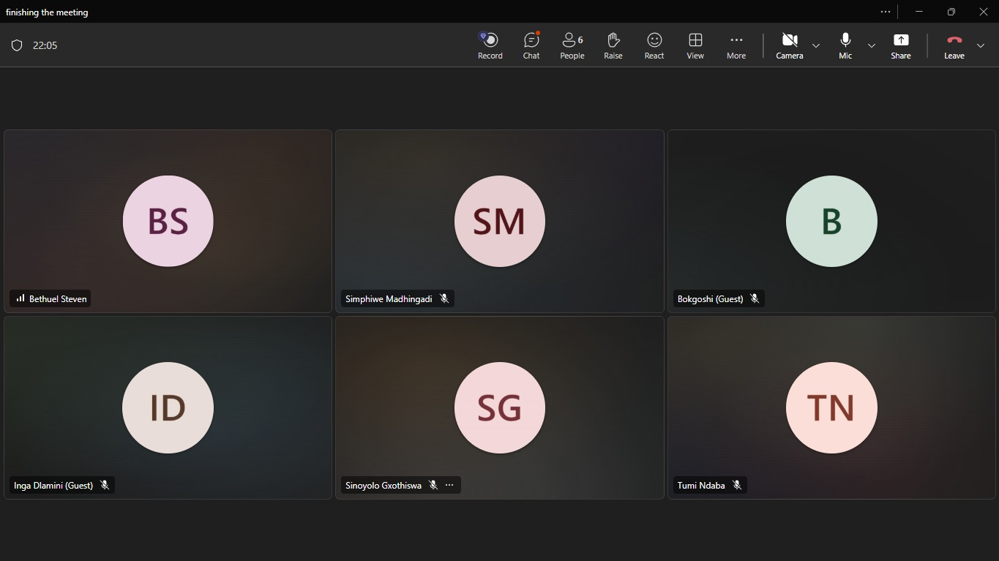

#### Daily Standup 4

* **Tumi** and **Simphiwe** gave an update on the authentication work.
* **Morare** confirmed the UI design work was complete.
* **Bethuel** was still working on the database and API together with **Inga**.

#### Client Meeting 3 – Progress Demo

The team demoed the current state of the project to the client, showing that a number of the user stories prioritised during sprint planning had been implemented. The client reviewed the demo and gave feedback on the progress made so far and on areas to focus on going into the sprint review.

#### Sprint Review

To close out Sprint 1, the team held a sprint review with the client to walk through the completed work, confirm what met the Definition of Done, and discuss what still needed attention.

The client acknowledged the progress made on process and setup — including the pull request template, the ESLint/Prettier configuration, and the documentation website structure — and gave feedback on the implemented user stories. At the same time, the client flagged a few gaps to carry into the next sprint, including work still outstanding on authentication, the database/API integration, and demonstrating how offline-captured data (local storage) will sync back to the backend as the source of truth. These points were noted as priorities for the Sprint 2 backlog.

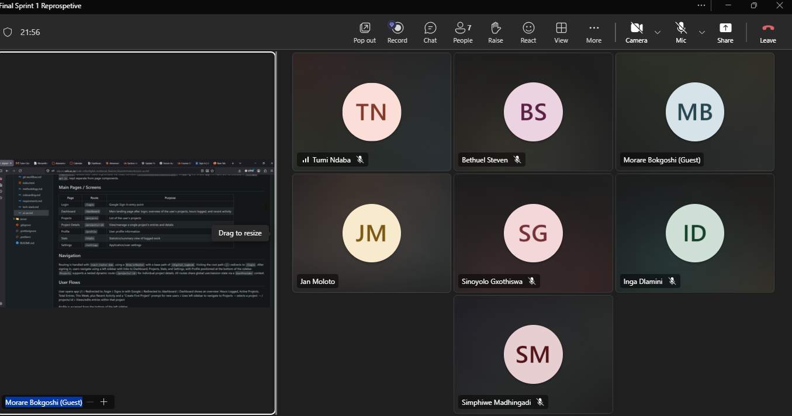

#### Sprint Retrospective

The Sprint 1 retrospective was held at the end of the Sprint 1 marking , where the team reflected on what went well and what needed improvement before moving into Sprint 2 planning.

Two main points were raised:

* **Communication** needed to improve going into Sprint 2 — raised by Inga.
* **Daily standups** needed to happen more consistently, and the **bug tracker** needed to actually be used and kept up to date going forward — raised by Simphiwe.

These two points were carried forward directly into the Sprint 2 backlog and working agreements.

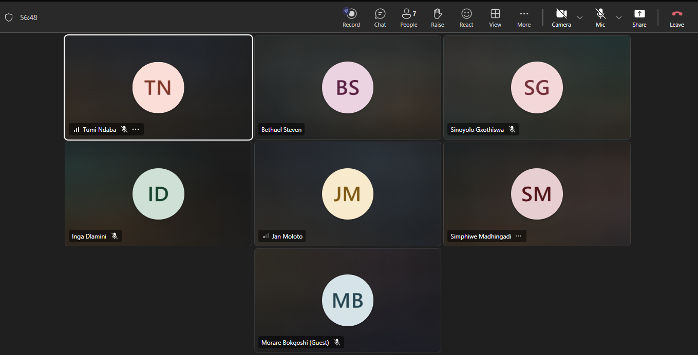

### 8.2 Sprint 2

Once a team has completed its first sprint, later sprints generally shift more heavily toward feature delivery, since the process and tooling groundwork is already in place. It's also standard Scrum practice for each sprint to open with a short retrospective on the sprint just finished before moving into planning for the new one — reflecting on what worked (and what didn't) before committing to new work helps the team avoid repeating the same process problems. This is exactly how Sprint 2 began below, with the Sprint 1 retrospective folded into the same meeting as Sprint 2 planning.

#### Sprint 2 Planning

During planning, the team discussed priorities for the sprint:

* **Deployment** — getting the application properly deployed was raised as a priority.
* **Feature selection** — the team reviewed the intermediate-level features on the backlog and selected a set to implement this sprint (see the full list under "User Story Assignment" below). Roles were not assigned during this meeting; assignment happened in a separate standup shortly after (see below).
* **User feedback** — since Sprint 1's work needed real feedback, Simphiwe would create a feedback document, and the deployed app plus the feedback document would be shared with outside testers for input.

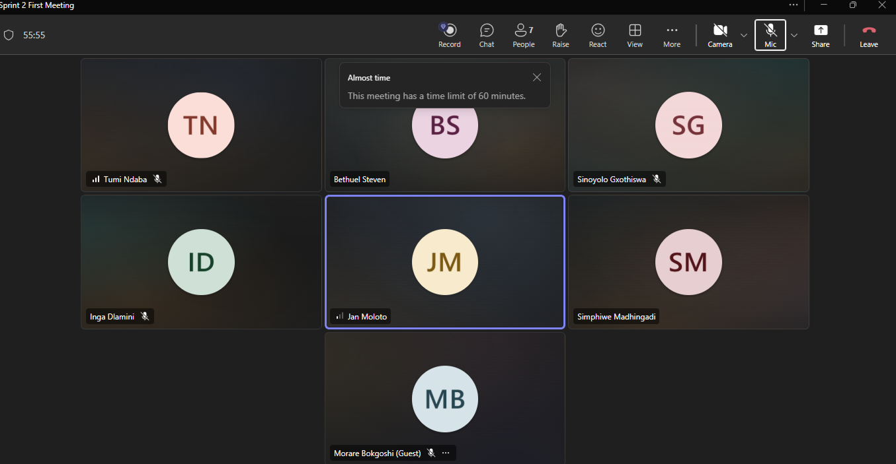

#### User Story Assignment

In a follow-up standup, the team assigned the selected user stories to individual members:

| Member | User Stories | Testing Responsibility |
| --- | --- | --- |
| Bethuel | US-106 — Add, remove or rename project fields without breaking old entries; Extra: profile picture support | Tests for field changes and profile pictures |
| Tumi | US-112 — Capture entries offline and sync when connection returns; US-101 — Tags on entries | Tests for offline/sync and tags |
| Inga | US-107 — Statistics on custom fields (total, group, compare, plot); Extra/Client Feedback: automatically calculate time spent on an entry | Tests for statistics and automatic time calculation |
| Morare | US-113 — Export and import the logbook; US-104 — References between projects; US-102 — Checklists on entries | Tests for export/import, project references and checklists |
| Simphiwe | US-109 — Calendar view; US-110 — Board view grouped by a chosen field; US-103 — Links between entries | Tests for calendar, boards and entry links |
| Sino | US-105 — Values computed automatically from other fields; US-111 — Unfinished work and due dates; US-108 — Saved filters | Tests for computed fields, due dates and saved filters |

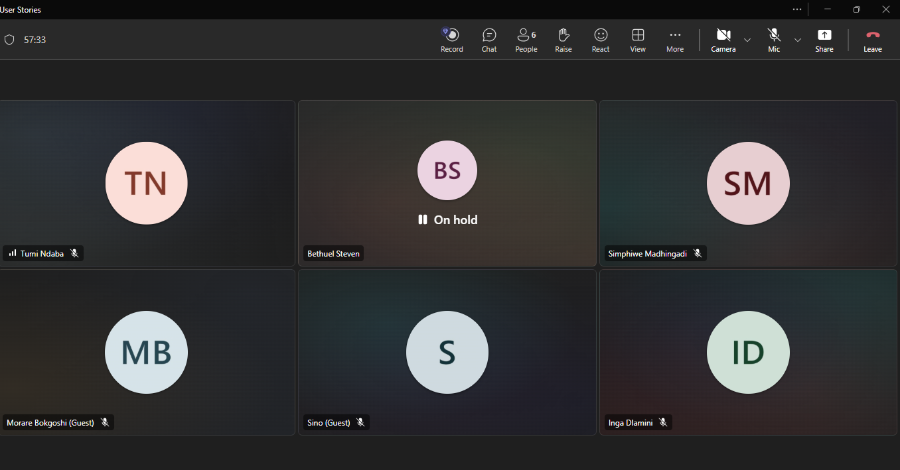

#### Daily Standup 1

Progress update: Simphiwe and Bethuel had both successfully deployed their work. Sino had implemented about half of her assigned user story. The remaining members had not yet started their assigned stories at this point.

#### Daily Standup 2

progress check-in: Sino was almost finished with her assigned work. No other members had updates to report at this point.

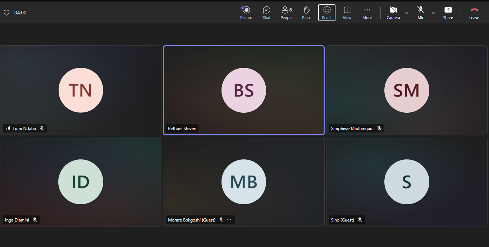

#### Daily Standup 3

Further progress update: Inga had started working on his assigned part. Tumi had finished implementing tags on entries (US-101). Morare had implemented US-113 (export/import) and was continuing work on his other assigned stories.

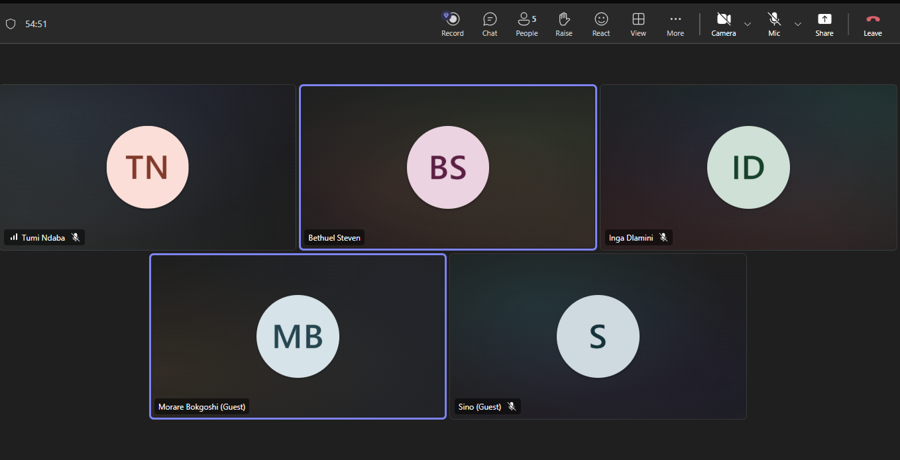

#### Sprint Review

The team held a sprint review with the client partway through Sprint 2, demonstrating the functionality implemented so far. Each member showed their assigned part of the work — for example, Inga demonstrated her part, followed by the other members doing the same for theirs.

The client's feedback was that the implemented features looked good overall, but navigation between some of the features was a bit confusing. The client described the work as a good work in progress and asked members to continue finishing their assigned stories.

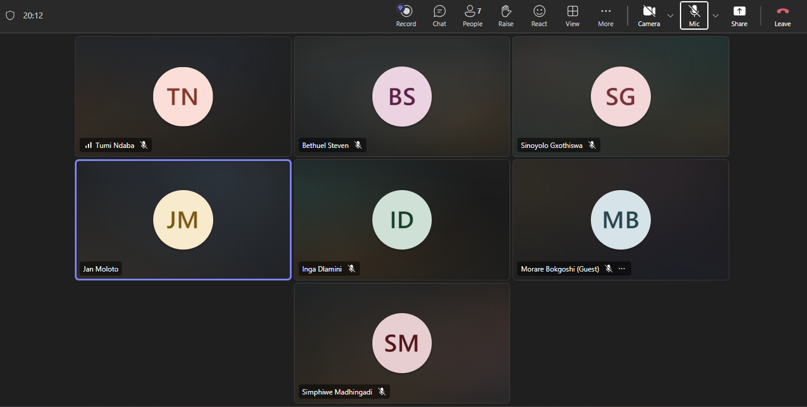

#### Sprint Retrospective

*Content pending — the Sprint 2 retrospective has not yet taken place. This section will summarise what went well during Sprint 2, what didn't go well, and what the team agreed to change or carry forward into Sprint 3.*

### 8.3 Sprint 3

*To be added.*

## 9. Stakeholder Reviews

Stakeholder interaction did not only happen at the scheduled client meetings and sprint reviews documented in Section 8 — it also happened continuously in between those meetings. The team and the client stakeholder share a WhatsApp group ("SDP (Logbook)"), which was used whenever a member hit a decision point or blocker that couldn't wait until the next formal meeting. This gave the team access to fast, informal stakeholder feedback throughout each sprint, in addition to the structured feedback captured during sprint reviews.

Below are examples of stakeholder feedback gathered this way, how the team evaluated it, and how it was integrated into the project.

### 9.1 Google OAuth configuration type

**Question raised:** Simphiwe asked the client whether the app's Google OAuth consent screen should be configured as **Internal** or **External**.

**Stakeholder feedback:** The client advised that it should be **External**, so that the application isn't restricted to a single Google Workspace organisation and can be used by everyone.

**Evaluation & integration:** Since the Digital Logbook is meant to be usable by any user with a Google account rather than a closed set of organisation accounts, the team agreed this matched the product's intended audience. The OAuth consent screen was configured as External accordingly, directly implementing the client's guidance.

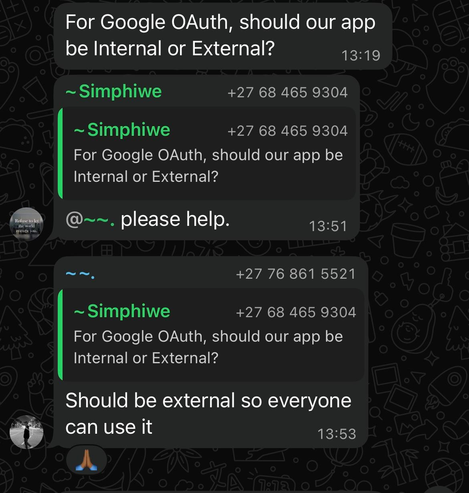

### 9.2 Frontend/backend project structure

**Question raised:** Simphiwe flagged that the repository had a `package.json` at the root, but `client/` already had its own frontend setup — meaning Bethuel and Morare had each independently created their own `package.json` files, resulting in duplicates. Simphiwe asked whether the root should be treated as the backend, or whether a separate `server/` folder should be created alongside `client/`.

**Stakeholder feedback:** The client advised keeping frontend and backend as separate `package.json` files, since the two are deployed independently, and suggested the root-level configuration could remain in place purely to support local development.

**Evaluation & integration:** The team accepted this recommendation, since it aligned with the project's requirement (from Client Meeting 1) to avoid a monolithic architecture and deploy the frontend and backend separately. This is reflected in the repository's current structure, which keeps a `client/` package.json distinct from the backend, with the root retained for local development convenience.

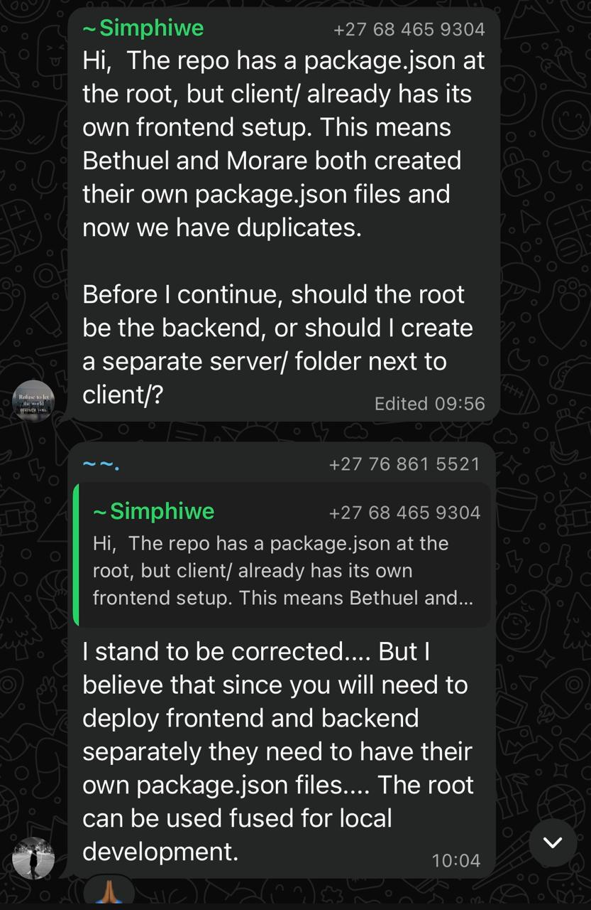

### 9.3 Code coverage and CI on Gitea

**Context:** During the Sprint 2 review, the client raised code coverage. Afterward, in an evening check-in, Bethuel (Scrum Master) followed up to confirm whether code coverage was needed for the current sprint, and the client responded that they would like to see it, and asked for it to be configured on Gitea.

**Stakeholder feedback:** The client confirmed code coverage reporting was wanted for the sprint and specifically requested it be set up as part of the Gitea workflow rather than tracked separately.

**Evaluation & integration:** The team agreed this was a reasonable and achievable request given the existing plan (Section 2 of Client Meeting 2) to define the CI/CD approach, and added configuring code coverage on Gitea to the backlog as a concrete follow-up task rather than leaving it as an open comment. **Status: outstanding** — this has been logged as a backlog item but is not yet implemented; it is carried forward as a task for an upcoming sprint.

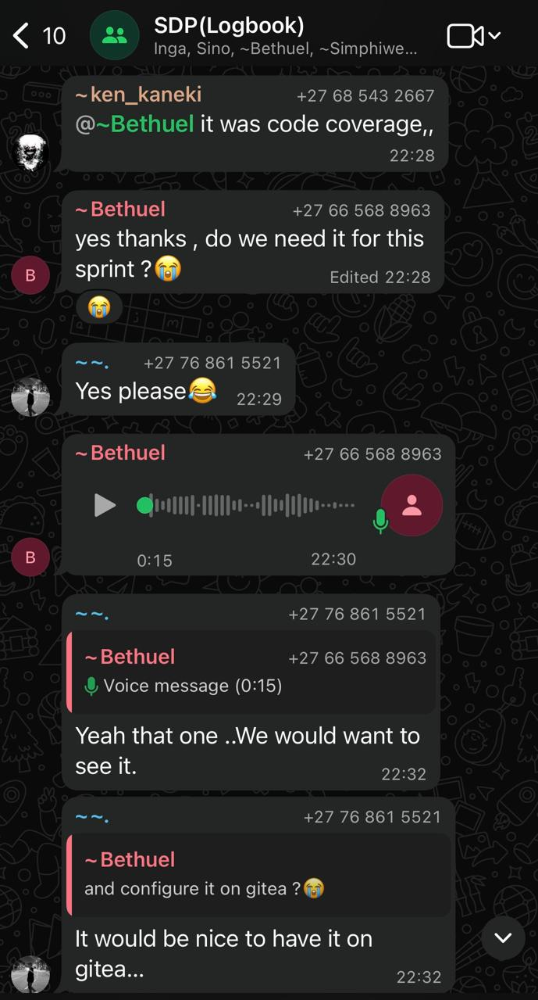

### 9.4 Client Meeting 1 — Project constraints and working agreements

**Context:** At the very first client meeting of Sprint 1, the client set out the constraints the team needed to work within.

**Stakeholder feedback:** The client specified that a development methodology had to be chosen and followed consistently, that the architecture should avoid a monolithic design, that Gitea would be used for repository management, that every feature had to go through a reviewed pull request on its own branch, and that sprint planning had to happen before each sprint. The client also confirmed they would act as a mentor rather than dictate solutions, and specified tooling: UX Pilot for prototypes, Lovable for the frontend, and (initially) browser Local Storage for temporary data.

**Evaluation & integration:** These constraints were adopted directly into the team's working agreements documented in Section 1–3 above (Agile/Scrum methodology, PR-based Git workflow, sprint planning process). The Local Storage guidance was later revisited by the team once its implications became clearer — see Section 9.5 below, which shows the team pushing back on an earlier assumption rather than integrating it unquestioned.

### 9.5 Client Meeting 1 (revisited) — Local Storage vs backend as source of truth

**Context:** Client Meeting 1 had suggested Browser Local Storage would be used for temporary data storage. During Sprint Planning, Member 3 (owning system architecture/backend/API) reviewed this assumption against the project's actual data needs.

**Feedback evaluated:** Rather than implementing the Local Storage suggestion as-is, the team evaluated it and corrected the assumption: Local Storage is not suitable as the primary database — it may later support offline capture/caching, but the backend/database must remain the authoritative source of truth once data is synced.

**Evaluation & integration:** This is a clear example of the team critically evaluating stakeholder input rather than applying it uncritically — the correction was documented in the Sprint Planning notes (Section 8.1) and was later confirmed with the client, becoming an open question tracked in Daily Standup 3 ("local storage vs backend source of truth") and ultimately a Sprint 1 Review gap to close in Sprint 2 (see Section 9.7).

### 9.6 Client Meeting 2 — Documentation, tooling and user stories

**Context:** The second client meeting focused on documentation and technical planning.

**Stakeholder feedback:** The client specified that documentation should cover architecture and the frontend/backend deployment approach, that a README would be used for tracking the tech stack and backlog, that daily standups would happen via voice notes/calls, that Bethuel would be Scrum Master, and that bugs (including merge conflicts) would be tracked on the same platform as project management. The client also walked through the first user stories: Google authentication, the dashboard, and project management features.

**Evaluation & integration:** Each of these points was carried directly into the team's documented process: the Scrum Master assignment, the bug-tracking approach, and the prioritised Sprint 1 user stories (Section 8.1, Sprint Planning) all trace back to this meeting.

### 9.7 Client Meeting 3 (Progress Demo) and Sprint 1 Review — Gaps identified and carried forward

**Context:** The team demoed Sprint 1 progress to the client, followed by a formal Sprint Review to close out the sprint.

**Stakeholder feedback:** The client acknowledged progress on process/setup (PR template, ESLint/Prettier, documentation site structure) but flagged outstanding gaps: authentication was incomplete, the database/API integration wasn't finished, and the team still needed to demonstrate how offline-captured Local Storage data would sync back to the backend as the source of truth (directly following on from Section 9.5).

**Evaluation & integration:** Rather than being noted and dropped, these gaps were explicitly written into the Sprint 2 backlog as priorities, showing a direct line from stakeholder feedback to backlog action.

### 9.8 Sprint 2 Review — Navigation feedback

**Context:** Partway through Sprint 2, the team held a sprint review where each member demonstrated their assigned feature.

**Stakeholder feedback:** The client felt the implemented features looked good overall, but noted that navigation between some features was confusing, and asked members to continue finishing their assigned stories.

**Evaluation & integration:** The navigation concern was accepted as a genuine usability gap rather than dismissed, and finishing the assigned stories (per the client's request) remained the team's stated focus for the rest of the sprint, as reflected in the Daily Standup 2 and 3 progress updates that follow.

### 9.9 Time-spent calculation — simplified after client feedback

**Context:** Inga's Sprint 2 work included automatically calculating time spent on an entry (an extra requirement added on top of US-107, statistics on custom fields).

**Stakeholder feedback:** The client reviewed how the hours were being calculated and found the approach confusing, asking for it to be made simpler.

**Evaluation & integration:** The team accepted this as valid usability feedback rather than defending the original approach, and the calculation logic was simplified accordingly as part of Inga's assigned work for the sprint.

*Source: raised verbally by the client during a Sprint 2 online meeting (no chat/screenshot record — captured from meeting notes).*

### 9.10 Custom entry format — scope widened for Sprint 2

**Context:** Client Meeting 2 (Section 9.6) had scoped the custom entry format to text/number/date-time fields only, explicitly for Sprint 1.

**Stakeholder feedback:** By Sprint 2 planning, the client's ongoing input had expanded this into a fuller set of field-related requirements — checklists (US-102), computed fields (US-105), references between projects (US-104), and links between entries (US-103) all appear as Sprint 2 user stories building directly on the original entry format.

**Evaluation & integration:** Rather than treating the Sprint 1 scope as final, the team tracked this as an evolving requirement and expanded the backlog for Sprint 2 to match, as shown in the User Story Assignment table (Section 8.2).

## 10. Why This Approach Suits Our Project

Scrum is appropriate for our project because development is collaborative and features can be developed independently and integrated progressively. Working in sprints allows us to identify problems early, receive feedback regularly, and adapt the project as requirements become clearer.

The combination of **sprint planning, a shared work tracker, regular check-ins, code reviews, and a clear Definition of Done** provides the team with a consistent process while still allowing flexibility throughout development.
