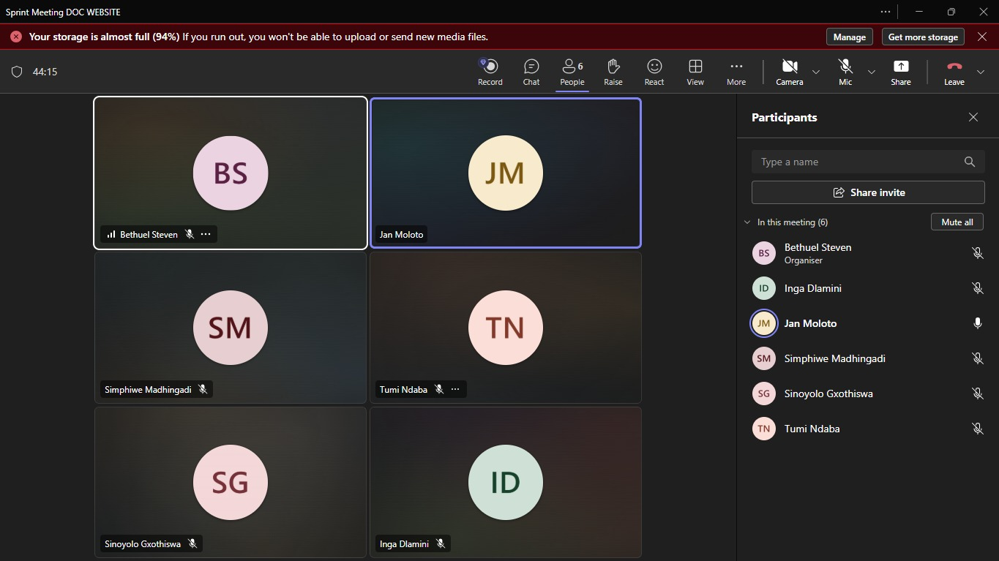
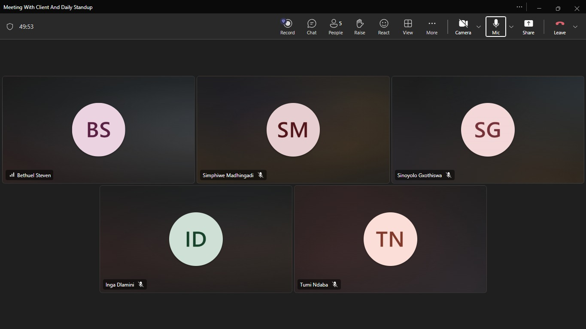
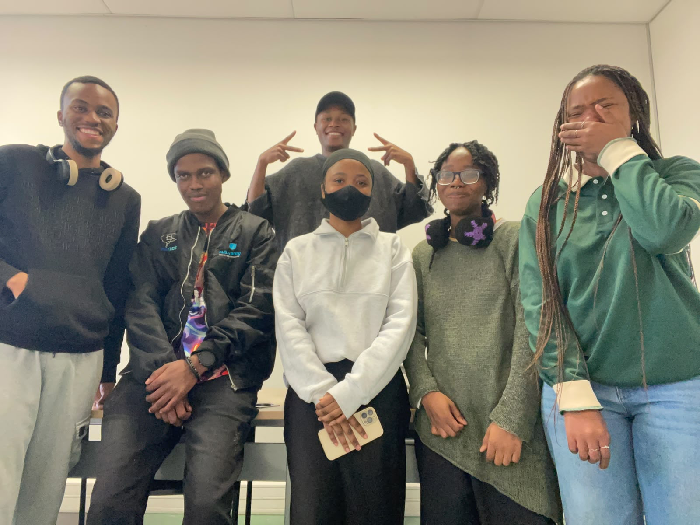
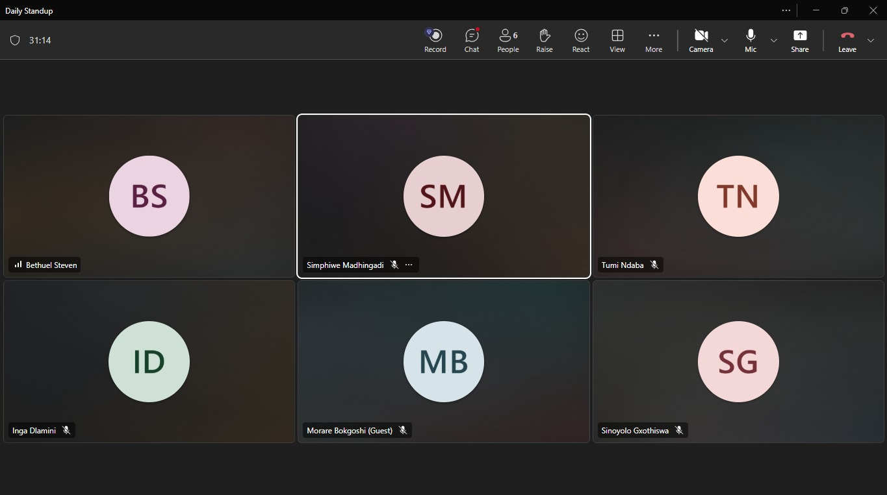
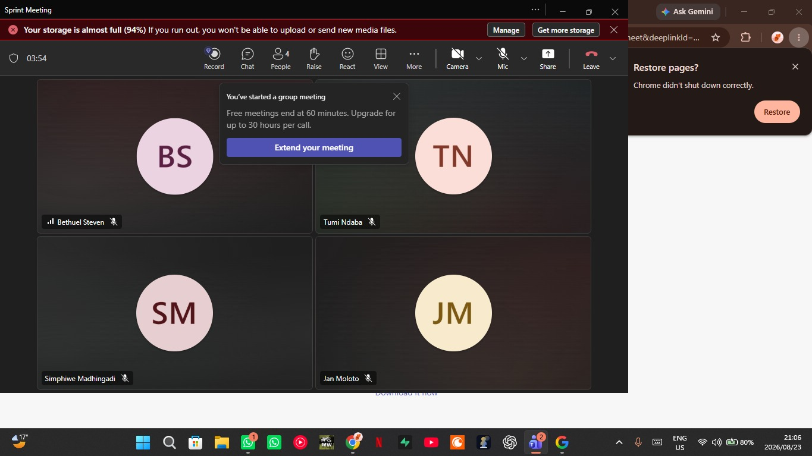
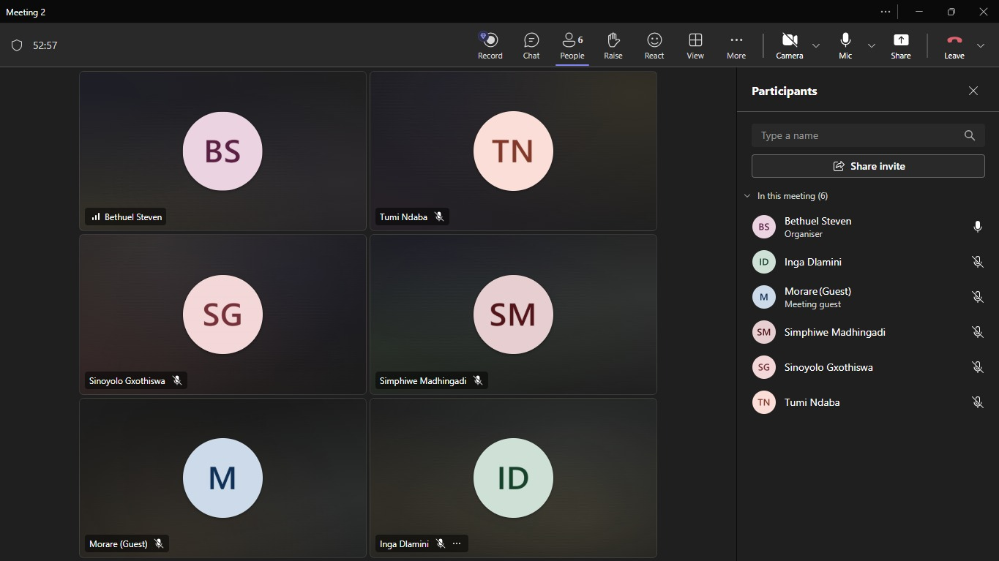
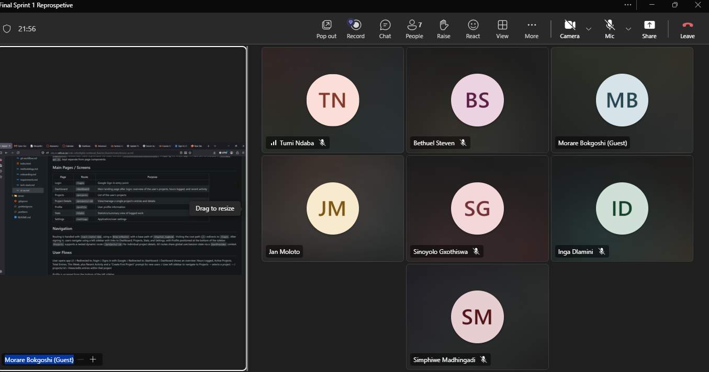

# Project Methodology, Sprint Planning & Work Tracker

Owner: Tumi

## 1. Agile/Scrum Methodology

Our project will follow an **Agile/Scrum methodology** because the project is being developed incrementally and requires regular feedback and adaptation. Instead of attempting to complete the entire system at once, the project will be divided into smaller features and tasks that can be implemented, tested, reviewed, and improved over multiple sprints.

Scrum is suitable for our group because it allows team members to work on different features concurrently while maintaining regular communication about progress and problems. It also allows requirements and priorities to be adjusted as the project develops.

Our Scrum process will consist of:

* **Product Backlog** – a prioritised list of features, requirements, bugs, and improvements.
* **Sprint Backlog** – the subset of backlog items selected for the current sprint.
* **Sprints** – short development cycles during which the selected tasks are implemented and tested.
* **Regular check-ins** – short meetings where members discuss progress, upcoming work, and blockers.
* **Sprint Review** – demonstration of completed functionality and discussion of feedback.
* **Sprint Retrospective** – reflection on what went well, what did not, and what can be improved in the next sprint.

This approach allows us to continuously deliver working functionality rather than waiting until the end of the project.

## 2. How Scrum Will Be Applied

At the beginning of each sprint, the team will review the Product Backlog and select the highest-priority items that can realistically be completed during the sprint.

Each selected item will be broken down into smaller tasks and assigned to team members. Team members will update the work tracker as they progress.

The general workflow will be:

**Backlog → To Do → In Progress → Review/Testing → Done**

Tasks will only be moved to **Done** once they satisfy the team's Definition of Done.

If requirements change during development, the team will discuss the change and update the backlog rather than making uncontrolled changes to the current sprint.

## 3. Sprint Backlog Process

The Sprint Backlog will contain the tasks selected for the current sprint.

During sprint planning, the team will:

1. Review the Product Backlog.
2. Prioritise the most important requirements.
3. Estimate the effort required for each task.
4. Select tasks that can realistically be completed within the sprint.
5. Break larger requirements into smaller development tasks.
6. Assign tasks to team members.
7. Confirm that the sprint has a realistic workload.

Tasks that are not completed during a sprint will be reviewed during the next planning session. They may be carried forward, reprioritised, or broken into smaller tasks.

## 4. Work Tracker

The work tracker will be used to provide a shared view of the project's progress. The team's Taiga board can be found here: [Taiga – Madhingadi Digital Logbook Backlog](https://tree.taiga.io/project/madhingadi-digital-logbook/backlog).

Each task should contain enough information for another team member to understand what needs to be done. Where appropriate, tasks should include:

* Task description
* User story or requirement
* Assigned member
* Priority
* Status
* Sprint
* Relevant issue or pull request
* Testing requirements

Tasks will move through the tracker as development progresses:

| Status             | Meaning                                                                  |
| ------------------ | ------------------------------------------------------------------------ |
| **To Do**          | Task has been selected but development has not started.                  |
| **In Progress**    | A team member is actively working on the task.                           |
| **Review/Testing** | Implementation is complete and is being reviewed or tested.              |
| **Done**           | The task satisfies the Definition of Done.                               |
| **Blocked**        | Progress cannot continue because of an unresolved dependency or problem. |

The tracker will help the team identify unfinished work and prevent tasks from being forgotten.

## 5. Blocker Handling

A blocker is an issue that prevents a team member from continuing with their assigned work.

Examples include:

* Waiting for another feature or API to be completed.
* Technical problems that cannot be resolved independently.
* Missing requirements or unclear acceptance criteria.
* Problems with the development environment.
* Integration or merge conflicts.

When a blocker occurs, the member should **raise it as soon as possible** rather than waiting until the end of the sprint.

The team will then determine whether another member can assist, whether the task needs to be temporarily changed, or whether the task should be reprioritised.

Blocked tasks will be clearly marked in the work tracker so that the rest of the team is aware of the issue.

## 6. Definition of Done

A task will be considered **Done** when:

* The required functionality has been implemented.
* The implementation satisfies the relevant acceptance criteria.
* The code follows the project's coding conventions.
* The feature has been tested appropriately.
* Existing functionality has not been unnecessarily broken.
* Any relevant bugs have been resolved.
* The code has been reviewed where required.
* Changes have been committed and pushed to the appropriate branch.
* Required documentation has been updated.
* The feature is integrated into the project successfully.

A task should not be marked as Done simply because the code has been written. It must be sufficiently tested and integrated to be considered complete.

## 7. Sprint Planning

Sprint planning will determine the goals and workload for each sprint.

The team will first review the current state of the project and the remaining Product Backlog. Higher-priority features and requirements will be considered first.

The team will then consider:

* The importance of the requirement.
* Dependencies between tasks.
* The estimated effort.
* Team member availability.
* Previous sprint progress.

The selected tasks will form the Sprint Backlog, and the team will agree on a clear **Sprint Goal**.

The Sprint Goal provides a shared objective for the sprint and helps the team decide which work should take priority if unexpected issues arise.

## 8. Sprints

This section summarises the meetings held throughout each sprint, including client meetings, sprint planning sessions, and daily standups, along with screenshots as proof of each meeting.

### 8.1 Sprint 1

#### Client Meeting 1

The client set out several expectations and constraints for how the project should be run:

* A development methodology must be chosen and followed consistently for the whole project.
* The system architecture should avoid a monolithic design.
* Gitea will be used for repository management throughout the project.
* Every feature must be merged through a reviewed pull request, developed on its own branch and only merged once approved.
* The team must prepare for group presentations of the project.
* The client will act as a mentor, offering guidance and feedback rather than dictating solutions.
* Sprint planning must happen before each sprint — planning tasks, assigning responsibilities, and setting sprint goals.
* Requirements and product direction should be discussed directly with the client.
* Client meetings will generally take place on Mondays, Tuesdays, and Saturdays.
* UX Pilot will be used to create UI prototypes.
* Lovable will be used to design the web frontend.
* Browser Local Storage will be used for temporary data storage.

#### Client Meeting 2

This meeting focused more heavily on documentation and technical planning:

* **Documentation** should cover the architecture, and the frontend/backend deployment approach needs to be discussed.
* The repository will be shared with the client, and the team still needs to decide on a project management tool.
* A README file will be used for project tracking, covering the tech stack and product backlog.
* **Methodology**: planning happens through the product backlog; daily standups will be done via voice notes or calls; sprint retrospectives will be held; Bethuel will act as Scrum Master.
* **Bug tracking**: bugs will be tracked and documented on the same platform used for project management. Things like merge conflicts and similar issues are also treated as bugs.
* **Database**: the team will produce ERD diagrams, and still needs to define the Git workflow and CI/CD approach. Testing will begin in Sprint 2.
* **User stories** discussed:
  * Authentication via a third-party provider (Google), including register, login, profile, and edit profile.
  * Dashboard showing total number of projects (active and archived), total log entries, recent log entries, and active entries.
  * Project management features: create, archive, add, view details, edit, search, and filter projects.

#### Sprint Planning

The team agreed on how they'd work together, assigned ownership of each area, and prioritised the first user stories for Sprint 1.

**Working rules:** the team is building one system together, not separate pieces stitched together at the end. Documentation must reflect actual group decisions, not solo assumptions — anything undiscussed gets raised with the group first. AI use is encouraged but never replaces understanding. Work is broken into small chunks with short deadlines, blockers are raised early, and major decisions (architecture, tech, structure) are made as a team. The agreed process: **Discuss → Decide → Document → Implement → Review → Integrate**.

**Ownership areas:** six areas were split one per member — owning an area means tracking and documenting it, not deciding it alone.

* **Member 1** – Methodology, sprint planning & work tracker
* **Member 2** – Git workflow & development standards
* **Member 3** – System architecture, backend & API. Also where the earlier Local Storage assumption from Client Meeting 1 was corrected: browser storage is not the primary database — it may later support offline capture/caching, but the backend/database stays the authoritative source once synced.
* **Member 4** – Frontend architecture, UI/UX, responsiveness & accessibility
* **Member 5** – Requirements, user stories & stakeholder interaction
* **Member 6** – Tech stack, documentation website & developer onboarding

**Working pairs:** Member 1+2, Member 3+4, Member 5+6, each pair being first point of contact for help/review.

**Sprint 1 user stories prioritised** (a small first selection): Authentication (Google sign-in), Profile (view/edit), Dashboard (project & entry overview), Create a project, and Custom entry format  (scoped to text/number/date-time fields for Sprint 1).

#### Daily Standup 1

* **Morare** worked on the UI design.
* **Tumi** created a pull request template for the repository.
* **Bethuel** set up ESLint and Prettier for the project.

The team also gave a brief update on their assigned ownership areas from sprint planning, confirming that early drafts were underway on the methodology and Git workflow documentation.

#### Daily Standup 2

* **Sinoyolo** set up the documentation website and asked everyone to start documenting their assigned section and placing it under their assigned file on Gitea.
* **Inga** started working on the database and API together with Bethuel.

#### Daily Standup 3

Each member gave a short update on the ownership area assigned to them during sprint planning. Early drafts were reported as underway on the methodology, Git workflow, and architecture documentation, and the team flagged a couple of open questions to confirm with the client before finalising those sections — including the local storage vs backend "source of truth" point, and the exact field-type scope for the custom entry format.

#### Daily Standup 4

* **Tumi** and **Simphiwe** gave an update on the authentication work.
* **Morare** confirmed the UI design work was complete.
* **Bethuel** was still working on the database and API together with **Inga**.

#### Client Meeting 3 – Progress Demo

The team demoed the current state of the project to the client, showing that a number of the user stories prioritised during sprint planning had been implemented. The client reviewed the demo and gave feedback on the progress made so far and on areas to focus on going into the sprint review.

#### Sprint Review

To close out Sprint 1, the team held a sprint review with the client to walk through the completed work, confirm what met the Definition of Done, and discuss what still needed attention.

The client acknowledged the progress made on process and setup — including the pull request template, the ESLint/Prettier configuration, and the documentation website structure — and gave feedback on the implemented user stories. At the same time, the client flagged a few gaps to carry into the next sprint, including work still outstanding on authentication, the database/API integration, and demonstrating how offline-captured data (local storage) will sync back to the backend as the source of truth. These points were noted as priorities for the Sprint 2 backlog.

#### Sprint Retrospective

*Content pending — to be added after the retrospective meeting. This section will summarise what went well during Sprint 1, what didn't go well, and what the team agreed to change or carry forward into Sprint 2.*

### 8.2 Sprint 2

*To be added.*

### 8.3 Sprint 3

*To be added.*

## 9. Why This Approach Suits Our Project

Scrum is appropriate for our project because development is collaborative and features can be developed independently and integrated progressively. Working in sprints allows us to identify problems early, receive feedback regularly, and adapt the project as requirements become clearer.

The combination of **sprint planning, a shared work tracker, regular check-ins, code reviews, and a clear Definition of Done** provides the team with a consistent process while still allowing flexibility throughout development.
