### What is tested

**Backend (`server/`)**

- Computed field formula evaluation — valid formulas, missing fields, invalid syntax (`services/computedFieldService.test.js`)
- Due date logic — overdue detection, completion status (`services/dueDateService.test.js`)
- Saved filter matching — all supported operators, built-in and custom fields (`services/savedFilterService.test.js`)
- Project detail service logic (`services/projectDetailsService.test.js`)
- Entry validation rules (`validation/entry.validation.test.js`)
- Profile picture uploads — valid image formats, and rejection of malformed, oversized, or disguised uploads (`tests/profilePictures.test.js`)
- Entry-to-entry links (`tests/projectDetailsLinks.test.js`)
- Project field editing — adding, renaming, removing, and archiving fields without breaking existing entries or computed formulas (`tests/projectFields.test.js`)

Running `npm test` from `server/` executes all of the above, combining Vitest and Node's native test runner in one command.

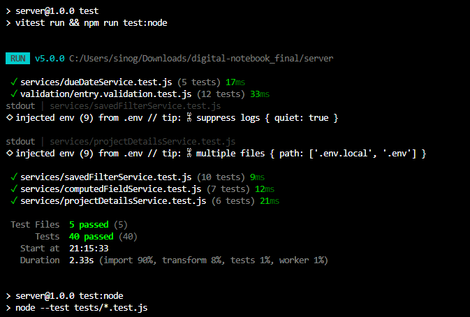

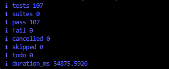

**Frontend (`client/`)**

- Entry creation and editing (`EditEntryModal.test.jsx`, `NewEntryModal.test.jsx`)
- Entry details view (`EntryDetailsModal.test.jsx`)
- Project details page behaviour (`ProjectDetails.test.jsx`)
- Alternate entry views — calendar/board (`entryViews.test.js`)
- Profile picture handling (`profilePicture.test.js`)
- User settings and preferences (`Settings.test.jsx`, `preferences.test.js`)
- Offline support — online/offline detection and the offline entry queue (`useOnlineStatus.test.js`, `entryQueue.test.js`)
- Entry feature API calls (`entryFeaturesApi.test.js`)

Running `npm test` from `client/` executes all of the above.

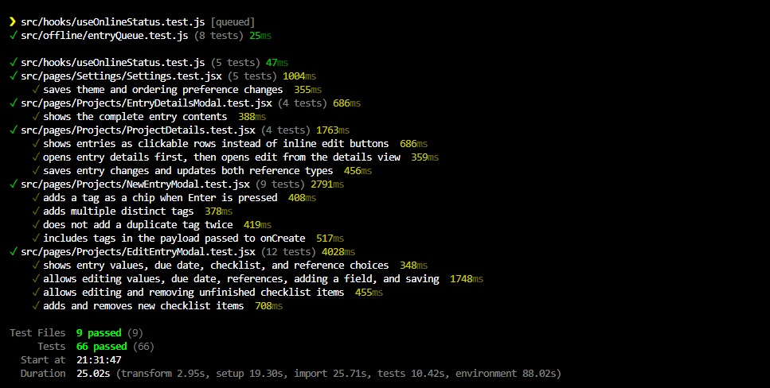

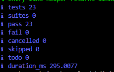

As of this document, the combined test suite across both `client/` and `server/` totals 20 test files and passes with several hundred individual tests and zero failures.

## User Feedback — Formal Process

The team collected formal user feedback through a structured Google Forms survey, run by Simphiwe. The survey received 9 responses, primarily university students (77.8% currently studying, mostly 3rd years), and covered onboarding, core feature usability, and overall satisfaction.

### Key findings

**Onboarding and core flows**

- 100% of respondents signed in successfully.
- 100% of respondents created a project without needing help; ease of project creation was rated highly (55.6% gave 5/5).
- 88.9% successfully created a logbook entry; one respondent (11.1%) did not.

**Usability**

- Navigation ease was rated highly: 55.6% gave the maximum score (5/5), with the remaining respondents rating it 4/5 or below.
- Most respondents reported nothing confusing about the app. Where confusion was reported, it centred on: entry/field creation, understanding the dashboard's logged-hours display, initial orientation, and sidebar navigation.
- Most respondents confirmed all buttons and labels were understandable; one respondent indicated otherwise without specifying further.

**Overall satisfaction**

- Average overall rating: 4.33 out of 5, with 55.6% of respondents giving the top score and no respondent rating the app below 3/5.

### Suggested improvements and how they were addressed

| Feedback received | Status |
|---|---|
| "The application should have stats... also a Calendar view" | ✅ Addressed — statistics (US-107) and calendar/board views (US-109/US-110) were implemented later in the sprint. |
| "tags on entries and able to update a filter" | ✅ Addressed — entry tags were added (offline-sync-tags feature), and saved filters can now be edited after creation. |
| "Maybe users should be given the ability to update their entries, even being able to delete them as well" | ⚠️ Partially addressed — entries can now be edited (`EditEntryModal`); entry deletion is planned for a future sprint. |
| "to make it in a way that will guide you as you go" | 🔜 Planned — an onboarding/guided-flow experience is being considered for a future sprint. |
| "down thoughts as you go" (in-the-moment note capture) | 🔜 Planned — a lightweight quick-capture feature is being considered for a future sprint. |
| "Efficiency" | 🔜 Noted — too general to act on directly; the team will revisit this once more specific feedback is available. |
| "AI chatbot to help navigate the system" | 🔜 Noted as a longer-term idea; not currently planned for an upcoming sprint but kept on record for future consideration. |
| "The application works really well, it doesn't need improvement" / "Nothing, I think the app is good" | — No action needed. |

### Process going forward

The items marked 🔜 above will be considered for prioritisation in future sprints, alongside any new feedback collected. Future rounds of feedback collection are expected to follow the same structured survey format used here, allowing direct comparison against this baseline and tracking of whether these planned improvements resolved the original concerns.

### Raw survey responses

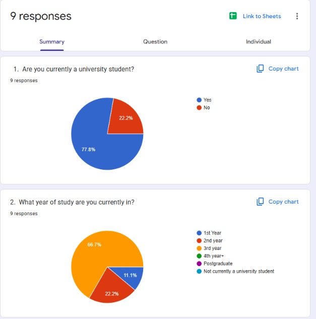

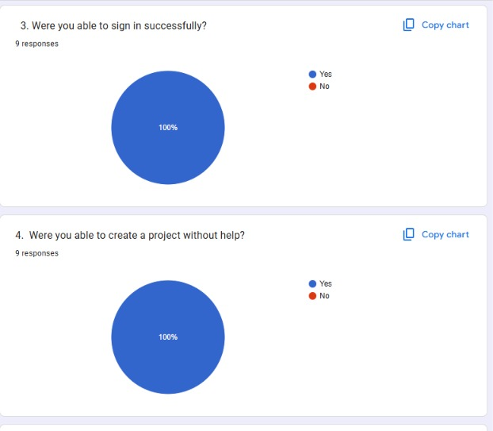

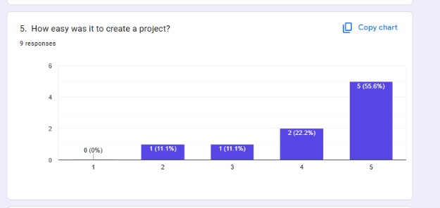

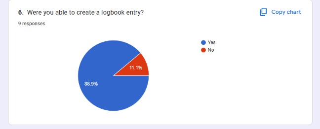

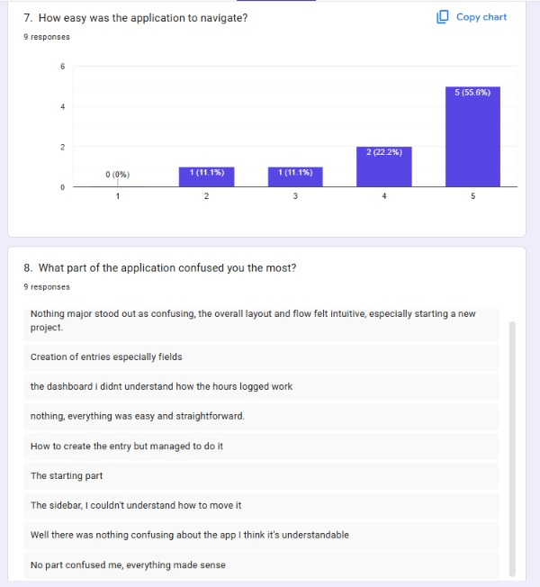

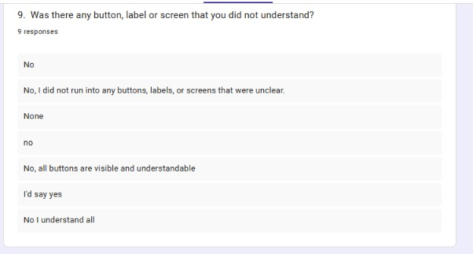

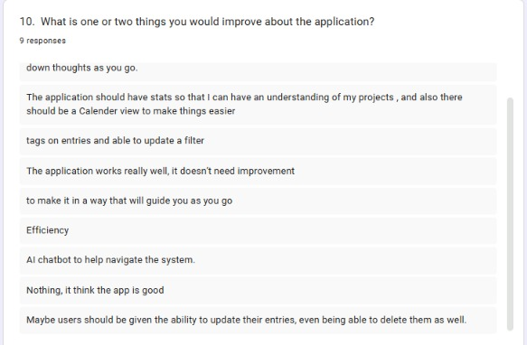

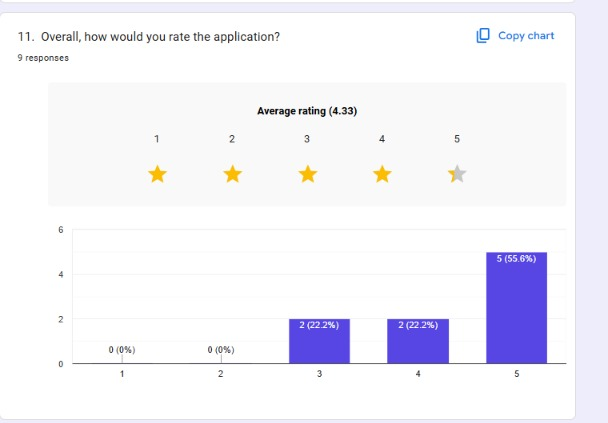
