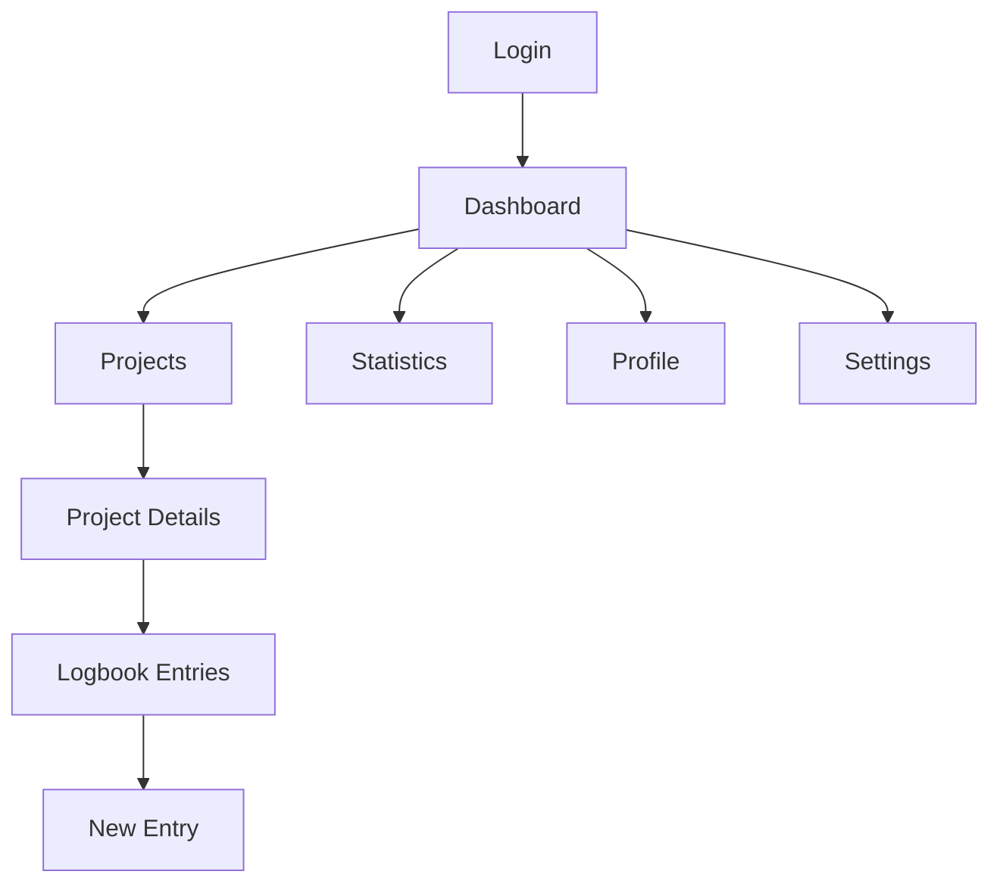
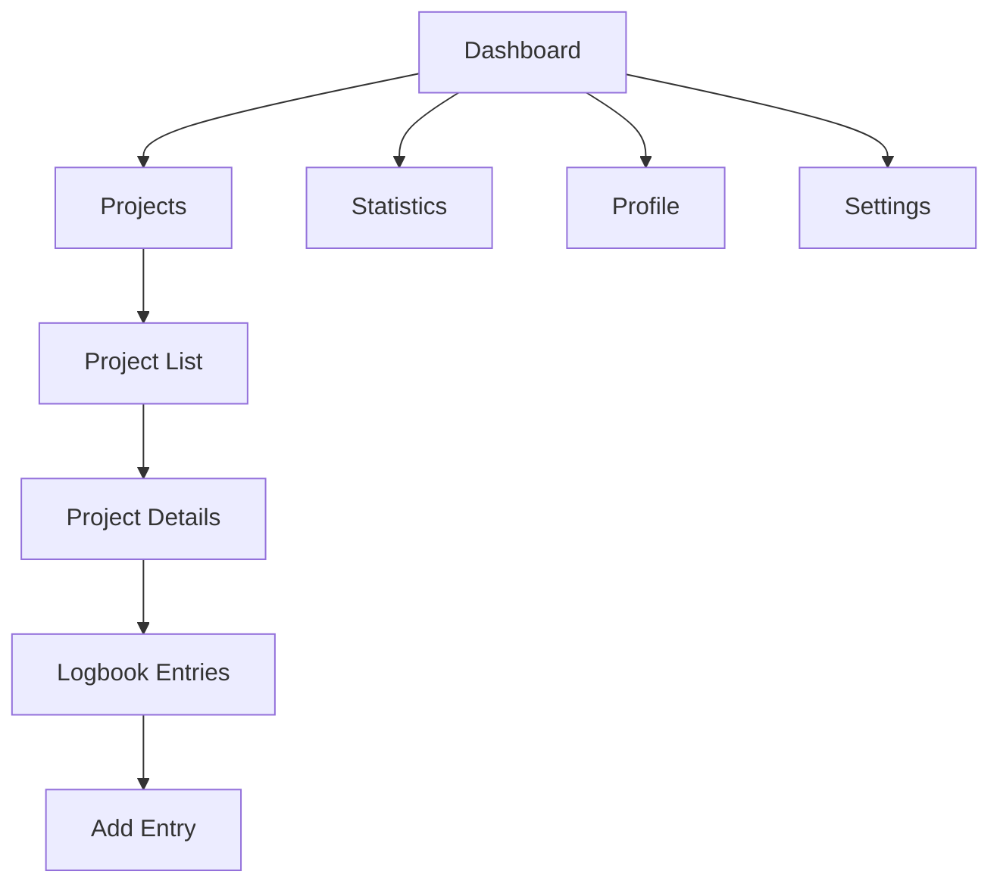
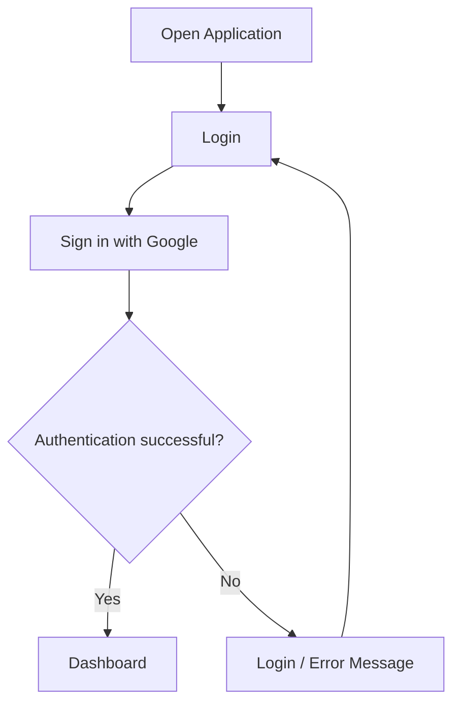
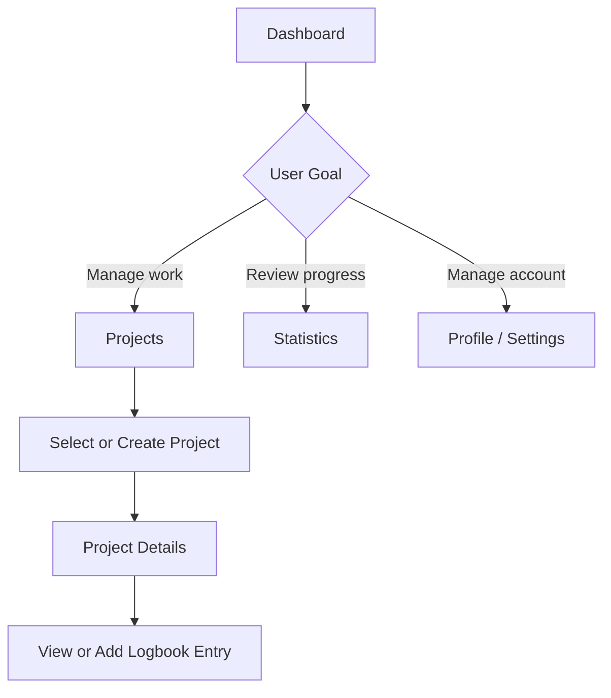
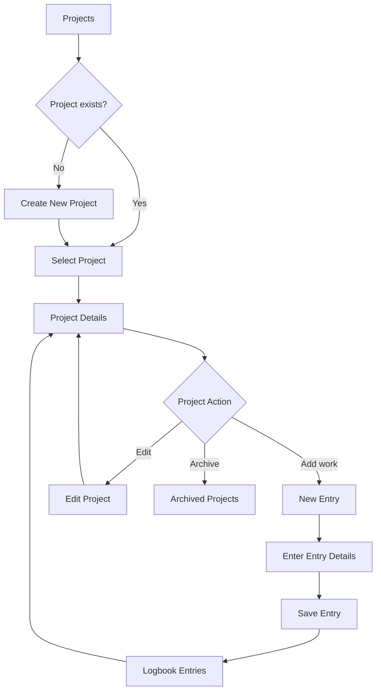
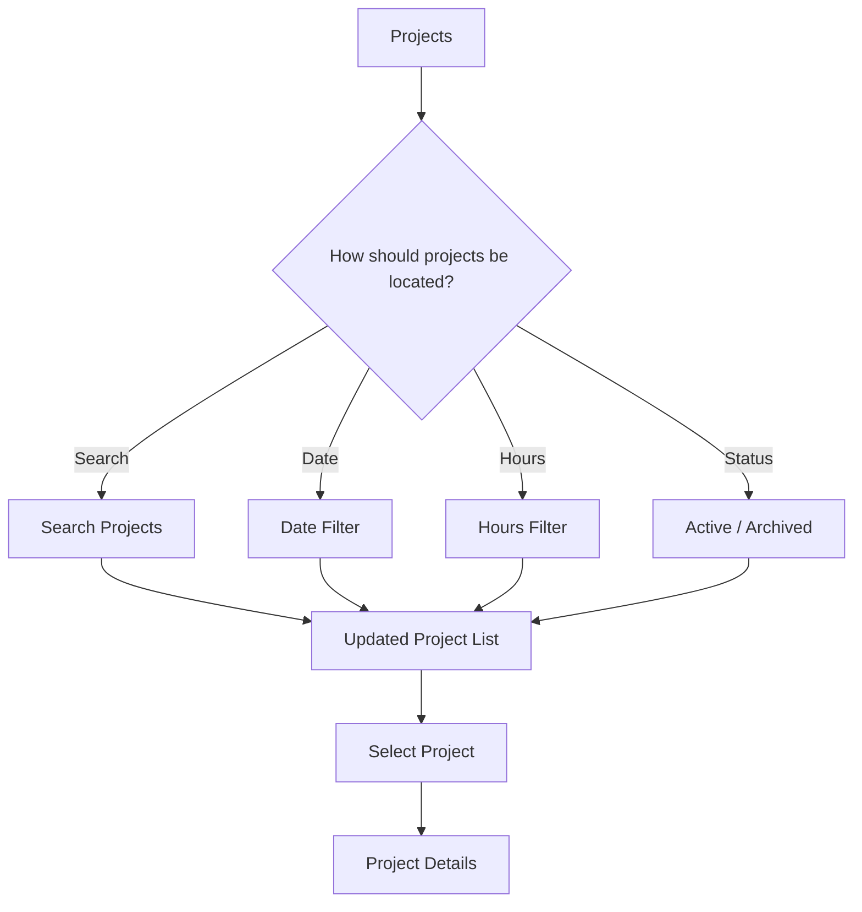
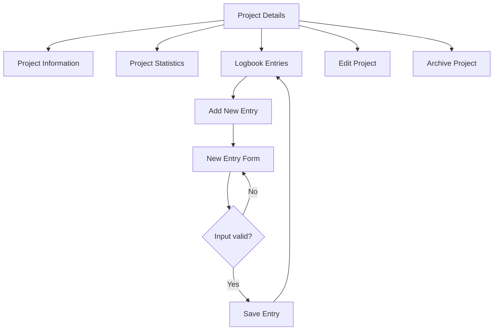
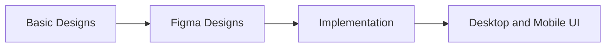
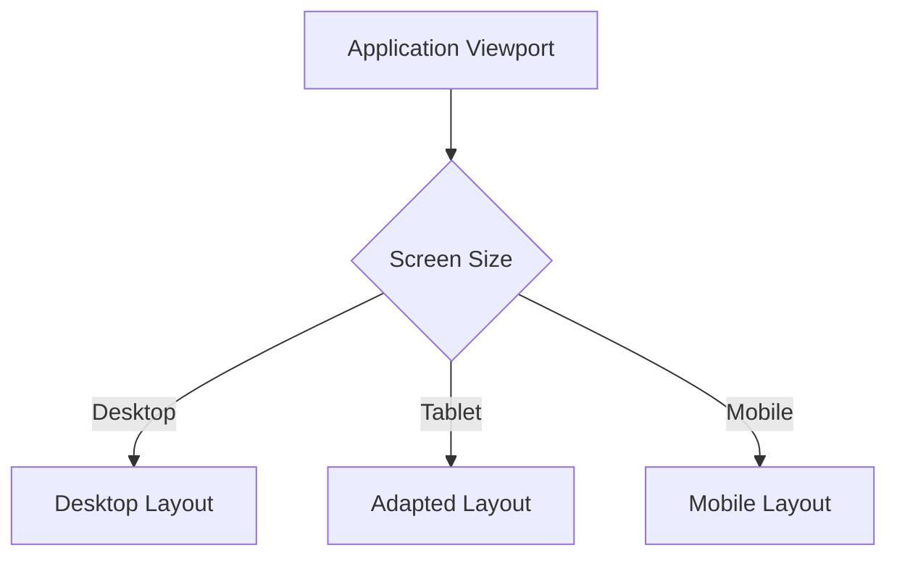

# Frontend Architecture, UI/UX, Responsiveness & Accessibility

Owner: Morare

## Frontend Architecture

The Digital Logbook client is a React single-page application built with Vite. The frontend is responsible for presenting the application's user interface, handling navigation between screens, maintaining client-side user state, and communicating with the backend through dedicated API modules.

The UI is organised so that page-level screens are kept separate from reusable interface components. This makes the interface easier to maintain and allows common elements such as the sidebar and project modals to be reused across the application.

### Client Repository Structure

The client follows a page/component-based structure. The main UI code is contained in `client/src/`:

```text
client/
├── index.html
├── package.json
├── vite.config.js
└── src/
    ├── App.jsx
    ├── App_mine.jsx
    ├── main.jsx
    ├── index.css
    ├── api.js
    ├── api/
    │   ├── projectDetailsApi.js
    │   └── userApi.js
    ├── components/
    │   ├── CreateProjectModal.jsx
    │   ├── EditProjectModal.jsx
    │   ├── ProjectModal.jsx
    │   ├── Sidebar.jsx
    │   └── README.md
    ├── context/
    │   └── UserContext.jsx
    └── pages/
        ├── Dashboard/
        │   ├── Dashboard.jsx
        │   └── README.md
        ├── LogIn/
        │   ├── Login.jsx
        │   ├── Login.js
        │   └── README.md
        ├── Profile/
        │   ├── Profile.jsx
        │   ├── Profile.css
        │   └── README.md
        ├── Projects/
        │   ├── Projects.jsx
        │   ├── ProjectDetails.jsx
        │   ├── NewEntryModal.jsx
        │   └── README.md
        ├── Settings/
        │   ├── Settings.jsx
        │   └── README.md
        ├── Stats/
        │   ├── Stats.jsx
        │   └── README.md
        └── README.md
```

The structure separates the main responsibilities of the frontend:

- `pages/` contains the application's main screens.
- `components/` contains reusable interface elements and modal components.
- `context/` contains shared user/session state through React Context.
- `api/` contains page-specific API functions so that backend communication is not mixed unnecessarily with presentation code.
- `index.css` contains global frontend styling.
- `App.jsx` defines the application's routes and connects the page structure.
- `main.jsx` provides the entry point for the React application.
- The README files inside the client folders provide additional local documentation for individual frontend areas.

This organisation supports the project's requirement for an organised file structure while keeping UI implementation separate from data-access and state-management concerns.

## Main Pages / Screens

| Page | Route | Purpose |
| --- | --- | --- |
| Login | `/login` | Entry point where the user signs in with Google. |
| Dashboard | `/dashboard` | Main landing page providing an overview of projects, logged hours, entries and recent activity. |
| Projects | `/projects` | Lists the user's projects and provides search, filtering, active/archived views and project creation. |
| Project Details | `/projects/:id` | Displays a selected project's details, statistics and logbook entries, and provides project/entry actions. |
| Profile | `/profile` | Displays and allows editing of user profile information. |
| Stats | `/stats` | Provides a summary of projects, entries, logged time and activity. |
| Settings | `/settings` | Provides the application's settings area. |

## Information Architecture

The application's information architecture is centred around the user's projects and the logbook entries recorded within them. Dashboard acts as the starting point after authentication, while the sidebar provides persistent access to the major areas of the application.

The structure below separates the **application shell**, **primary navigation**, and **project-specific workspace** so that the relationship between screens is easier to understand.



The hierarchy keeps the application's primary purpose visible: users enter through authentication, reach the main application, and then move into projects and their associated logbook entries.

## Navigation

Routing is handled with `react-router-dom` using a `BrowserRouter` with the base path `/digital_logbook`. The root path redirects to `/login`. After signing in, the user can move between the main application areas through the persistent left sidebar.

The sidebar contains:

- Dashboard
- Projects
- Stats
- Settings
- Profile, positioned at the bottom of the sidebar

The sidebar can also be collapsed to reduce the amount of screen space occupied by navigation while retaining icon-based access to the same destinations. Active navigation items are visually distinguished from inactive items.

`Projects` also contains a dynamic route, `/projects/:id`, allowing a selected project to have its own detail view.

### Navigation Flow

The navigation model is deliberately separated into **global navigation** and **project-level navigation**. The sidebar gives direct access to the main application areas, while project actions are reached from the Projects page.



This creates a shallow navigation structure: the user does not need to move through multiple unrelated screens to reach a major section, while project-specific actions remain grouped within the project workspace.

## User Flows

### Authentication Flow

The initial application flow begins at the root route. The user is redirected to the login screen and then signs in before accessing the main application experience.



### Main User Flow

The main user journey begins at the Dashboard and branches according to the user's immediate goal. Projects is the primary operational path, while Stats, Profile and Settings provide supporting functionality.



### Project and Logbook Flow

The project workflow is the central task flow of the application. A user can create a project, open it, manage its details and record work as logbook entries.



### Project List Interaction Flow

The Projects screen supports several ways of locating and organising projects before opening a project.



## Dashboard Design

The Dashboard is designed as an overview rather than a data-entry screen. It gives the user an immediate summary of their current activity and directs them towards the next useful action.

The interface includes:

- Welcome/header area.
- New Project action.
- Summary cards for active projects, total entries, hours logged and weekly activity.
- Recent Activity section.
- Get Started/empty-state guidance for users who have not created a project yet.
- Overview information with a link towards statistics.

The empty-state design is particularly important for first-time users because it does not leave the dashboard blank. Instead, it explains what the user can do next and provides a direct action to create their first project.

## Projects Design

The Projects screen is the main project-management interface. It provides the user with tools for locating, filtering and creating projects.

The main interactions are:

- Create a new project.
- Search projects by text.
- Filter projects by date.
- Filter projects by hours.
- Switch between active and archived projects.
- Clear or apply filters.
- Open a project to access its details.

When there are no projects, the interface uses an explanatory empty state with a clear call-to-action rather than displaying an empty list without guidance.

## Project Details and Logbook Entry Design

The Project Details screen provides a focused workspace for a selected project. It exposes the project's information and its logbook activity without requiring the user to leave the project context.

Available project-level interactions include:

- Return to the Projects list.
- Edit project information.
- Archive the project.
- Add a new logbook entry.
- View project statistics/details.
- View the project's entries.

New entries are created through a dedicated modal. The entry form supports an entry name, duration and project-specific fields/tags. Validation and error feedback are displayed within the interaction before the entry is saved.



## Profile, Statistics and Settings

### Profile

The Profile screen allows the user to view and edit personal profile information. The interface is organised into clear sections for profile information, biography and additional details.

### Statistics

The Stats screen provides a higher-level view of progress. It includes summary information for projects and entries and an activity overview. Where no data is available yet, the interface communicates this state and explains what will become available after the user begins creating projects and entries.

### Settings

The Settings screen provides the application settings area. The current implementation presents the settings section as work in progress, making the current implementation state explicit rather than presenting incomplete controls as functional features.

## Design Process

The UI was developed through an iterative process that moved from **basic designs**, to **Figma designs**, and finally to the **implemented application**.

The design material for this process is stored in the `docs/pdf/` folder of the repository. This folder contains the project's UI/UX design evidence, including the basic designs and the final Figma-based desktop and mobile designs.

### Design-to-Implementation Flow



The progression demonstrates how the visual design was translated into the implemented interface rather than treating the final application as an isolated development step. The design evidence is available in `docs/pdf/`.

## Design Principles

The interface design follows several practical principles:

### 1. Clear hierarchy

Important information such as page titles, project names, summary values and primary actions is visually prioritised so that users can understand a screen quickly.

### 2. Consistent navigation

The sidebar provides a stable navigation structure across the main application screens. This reduces the need for users to learn a different navigation pattern on each page.

### 3. Action-oriented interfaces

Primary actions such as `New Project`, `Create First Project` and `Add New Entry` are visually prominent and placed near the content they affect.

### 4. Context-preserving interactions

Project editing and entry creation use modal interfaces where appropriate. This allows users to complete focused tasks without unnecessarily navigating away from the current project context.

### 5. Meaningful empty states

Screens with no data provide an explanation and, where possible, a next action. This is especially important for first-time users who have not yet created projects or entries.

### 6. Responsive behaviour

The interface adapts to different viewport sizes instead of treating the desktop layout as the only supported experience.

## UI Components and Interaction Patterns

The frontend uses a consistent set of reusable interaction patterns:

| Component / Pattern | Purpose |
| --- | --- |
| Sidebar | Primary application navigation and profile access. |
| Collapsible Sidebar | Reduces navigation width while retaining access to navigation icons. |
| Primary Buttons | Emphasise important actions such as creating projects or entries. |
| Project Cards / List States | Present project information and project availability. |
| Search | Allows users to locate projects quickly. |
| Filters | Supports date- and hours-based project filtering. |
| Tabs | Separates active and archived projects. |
| Modal Dialogs | Supports project creation, project editing and new-entry creation without leaving the current page. |
| Summary Cards | Present high-level dashboard and statistics information. |
| Empty States | Explain unavailable data and guide the user towards the next action. |
| Error / Loading States | Communicate when data is loading or when an operation cannot be completed. |

## Responsive Design Approach

The interface was designed for both desktop and mobile use. The design evidence for the desktop and mobile versions is included in the `docs/pdf/` folder.

The Login page uses a responsive breakpoint at `768px`. Below this width, the two-column layout collapses into a single-column layout, the branding panel becomes full-width, and secondary content such as the feature list and footer is hidden to keep the mobile experience focused on authentication.

The broader UI follows the same responsive principle: layouts should prioritise the main task and content when horizontal space becomes limited. Controls are arranged vertically where necessary, while the navigation and content areas adapt to smaller screens.

### Responsive Design Flow



## Accessibility Approach

Accessibility has been considered through the use of semantic HTML, native controls, visible focus states and descriptive labels in important interactive areas.

Examples in the implemented client include:

- Semantic headings such as `<h1>`, `<h2>` and `<h3>` to establish page hierarchy.
- Native `<button>` elements for actions rather than using non-interactive elements as buttons.
- `aria-label` attributes on important controls such as the sidebar collapse control, profile navigation and modal close controls.
- `aria-modal` and `aria-labelledby` on the new-entry modal.
- Visible `:focus-visible` styling on important sidebar controls.
- Clear text labels on form inputs.
- Error and loading states that communicate system status to the user.
- Responsive layouts that avoid requiring a desktop-width viewport for core functionality.

There are also known areas for improvement. In particular, the Login page's Google Sign-In implementation and decorative SVG handling should be reviewed further for keyboard and screen-reader behaviour, and placeholder Terms of Service and Privacy Policy links should become functional when the corresponding pages or destinations are available.

## UI/UX Implementation Evidence

The UI/UX design is represented in the implementation through the following frontend areas:

- `src/pages/LogIn/` — authentication interface.
- `src/pages/Dashboard/` — dashboard and overview experience.
- `src/pages/Projects/` — project list, filtering, project details and logbook-entry creation.
- `src/pages/Profile/` — profile interface.
- `src/pages/Stats/` — statistics and progress interface.
- `src/pages/Settings/` — settings interface.
- `src/components/Sidebar.jsx` — shared application navigation.
- `src/components/CreateProjectModal.jsx` — project creation interaction.
- `src/components/EditProjectModal.jsx` — project editing interaction.
- `src/components/ProjectModal.jsx` — reusable project modal interface.
- `src/context/UserContext.jsx` — shared user state used by the client.
- `src/api/` — frontend API integration separated from presentation components.

The final Figma-based designs and other UI/UX design material are stored in `docs/ui-ux_pdfs/`.

## Summary

The frontend UI/UX is structured around a clear user journey: authenticate, reach the dashboard, manage projects, open a project, record work through logbook entries, and review progress through statistics. Persistent navigation provides access to the main areas while project-specific actions remain within the project context.

The design process progressed from basic designs to Figma designs and then to implementation. The repository structure separates pages, reusable components, shared state and API communication, making the UI easier to maintain and extend. Responsive layouts, meaningful empty states, clear interaction patterns and accessibility considerations are incorporated into the implemented interface.
